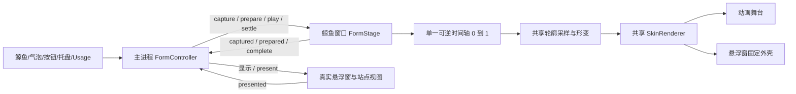
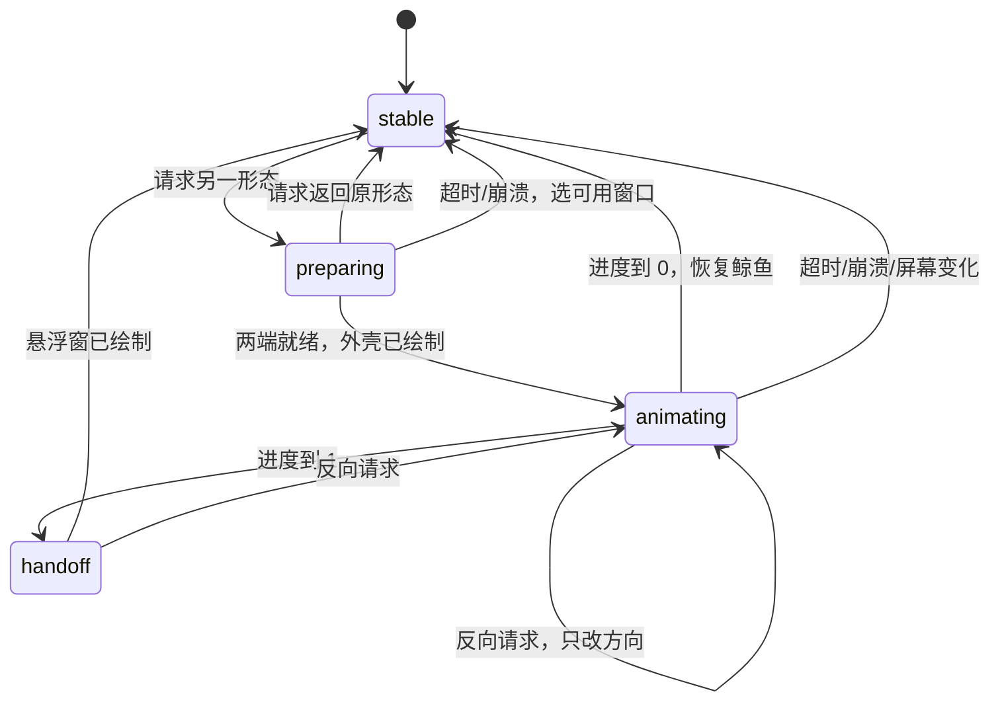

# ChatDeck 架构

> 用最简单的话说：ChatDeck 是一个常驻桌面的「悬浮小窗套壳浏览器」+ 一只小鲸鱼 + 一个余额小窗——平时鲸鱼在桌面上游，点一下它展开内嵌 LLM 网页的悬浮窗；收起时倒放同一段张嘴变形动画，在窗口当前位置变回鲸鱼。托盘右键放设置、余额监控等入口；没有主窗口。

## 技术栈

Electron（主进程 + WebContentsView）+ Vue 3 + TypeScript + Pinia + electron-vite + Vitest。

鲸鱼（悬浮窗压缩形态）渲染层移植自 whale-pet 项目（纯 TypeScript 行为脚本，不用 Vue）；
余额监控小窗移植自 token-balance 项目（同样是纯 TypeScript 渲染层）。

## 整体结构

```
┌────────────────────────────┐  ┌──────────────────────────────┐  ┌────────────────────────┐
│ FloatWindow (悬浮窗·展开态)  │  │ WhaleWindow (鲸鱼·压缩态)     │  │ BalanceWindow (余额小窗)│
│ 384×644,内面板360×620         │  │ 覆盖当前显示器工作区            │  │ 196×56 起,按内容自适应   │
│ + transparent + alwaysOnTop │  │ 默认鼠标穿透(forward)         │  │ 无边框透明胶囊/卡片      │
│ ┌────────────────────────┐ │  │ ┌──────────────────────────┐ │  │ ┌────────────────────┐ │
│ │ FloatHeader (HTML)      │ │  │ │ SVG 鲸鱼 + Canvas 特效    │ │  │ │ 胶囊:各站点余额      │ │
│ ├────────────────────────┤ │  │ │ (水花/气泡/涟漪/尾迹/Zzz/爱心) │ │  │ ├────────────────────┤ │
│ │ WebContentsView (站点)  │ │  │ ├──────────────────────────┤ │  │ │ 卡片:列表/编辑站点   │ │
│ │ 或 FloatPrompts (HTML)  │ │  │ │ 未读气泡(HTML,头顶跟随)  │ │  │ │ (展开态,含刷新)     │ │
│ ├────────────────────────┤ │  │ └──────────────────────────┘ │  │ └────────────────────┘ │
│ │ 底部提示词条 (HTML)      │ │  │ 悬停鲸鱼 → 开启窗口交互        │  │ 托盘右键「余额监控」开关  │
│ └────────────────────────┘ │  │ 单击鲸鱼 → 展开悬浮窗          │  │ 与悬浮窗/鲸鱼互不影响    │
└────────────────────────────┘  └──────────────────────────────┘  └────────────────────────┘
        稳定时两种形态视觉互斥（鲸鱼窗口常驻可见但页面全透明）；交接时短暂重叠同一个外壳；余额小窗独立并存，托盘开关控制显隐
```

**关键点：WebContentsView 是原生层，永远盖在 HTML 上面。** 所以悬浮窗 UI 划分为两类：

1. **永不被遮挡的区域**（纯 HTML）：悬浮窗头部、提示词面板、底部条。所有交互控件都在这些区域。
2. **站点区域**：主进程把 WebContentsView 放在渲染层算出来的矩形里。加载失败时在视图内部加载本地 `resources/error.html`（重试按钮走 error preload 的 IPC），**而不是**用 HTML 盖上去（盖不住）。

## 窗口形态：鲸鱼 + 悬浮窗 + 余额小窗 + 设置窗口 + 译文弹窗

应用没有主窗口，五个窗口各司其职、共用同一批站点会话分区：

```
app（单实例 + 托盘常驻,窗口全关也不退出,退出只走托盘「退出」）
├─ WhaleWindow    鲸鱼窗口(压缩形态,启动默认显示)  ── 无站点视图
├─ FloatWindow    悬浮窗(展开形态,站点唯一宿主)     ── ViewManager ◀─ fview:* 通道（移动端 UA）
├─ BalanceWindow  余额小窗(独立,托盘开关控显隐)      ── 无站点视图,主进程轮询余额
├─ SettingsWindow 设置窗口(惰性创建,关闭即销毁)      ── 无站点视图,承载设置/提示词库面板
└─ TranslatePopup 译文弹窗(依附悬浮窗位置,见下节)    ── 无站点视图
```

- **形态协调器**（`main/formController.ts`）：所有展开/收起入口都发目标形态，包括桌宠、气泡、托盘、头部按钮、Usage 页和二次启动。它负责准备、可逆播放、窗口交接、超时和崩溃恢复。
- **鲸鱼窗口**：覆盖当前显示器工作区的透明窗口，兼作变形动画舞台。平时只有鲸鱼/气泡命中时接管鼠标；动画期间只有当前外形接管鼠标，点击可立即反向。收起到副屏后，鲸鱼继续在该屏活动。调试:`CHATDECK_WHALE_PINNED=1` 启动进入钉住模式(whale.html?pinned=1),鲸鱼停在初始位不自主游动,供形态/截图测试复现。开发期(仅 `!app.isPackaged`)另有 `CHATDECK_USERDATA=<dir>` 重定向 userData 隔离第二实例、`CHATDECK_CDP=<port>` 开 remote-debugging-port,供 CDP 按目标截图/求值的自动化验证;换形无闪烁的连拍验证用 `scripts/grab-frames.ps1`(屏幕区域逐帧抓屏)+ `scripts/analyze-frames.mjs`(逐帧亮度曲线/突陷帧检测)——透明窗口不吃 CDP screencast,截图验证必须抓屏幕。
- **悬浮窗**：原生窗口 384×644 DIP，左/上各 24 DIP 给尾巴留空间；内面板 360×620。聊天视图为 `(34,108,340,484)`，Vue 布局和主进程共用尺寸。蓝色头部、边框、白眼睛和外伸尾巴来自共用 SVG 画笔。
- **真实内容交接**：张嘴 200ms + 外壳增长 500ms，共用一个 0→1 进度；倒放只改变进度方向。增长时只有空外壳，完成后显示聊天和按钮。收起方向分两条路径：**截图外壳（常规）**——主进程先捕获悬浮窗整窗快照（主页玻璃壳 `capturePage` + 各站点 WebContentsView 按布局矩形逐视图捕获，WebContentsView 是独立合成面不在主页截图里），随 prepare 命令发给鲸鱼渲染层；外壳端点改为**整窗矩形**（蓝色主体填充透明、装饰性尾鳍/眼睛塌缩，快照图裁剪在主体轮廓内随融化变形）——鲸鱼窗口显示时其内容与真实 UI 逐像素一致，DWM 显示过渡（~200ms）期间两窗叠放不可感知；covered 回执延迟按路径区分——截图外壳逐像素一致只留合成器提交余量（coveredShotDelayMs 48ms），兜底淡入须等 140ms 淡入盖满（coveredDelayMs 340ms）——covered 后主进程才隐藏悬浮窗并开始融化。主页与站点视图**并行**捕获（单张超时 500ms），缩短按下收起到动画开始的延迟。融化是**两段式**：阶段 A（进度 1→0.45）轮廓保持面板形状，快照内容在整块不透明蓝色面板内溶解（`bodyOpacity` 恒 1、嘴部暗色填充 `mouthFill` 撑满阶段 A——若轮廓从第一帧就退让，顶带/内容区会在内容仍可见时透出桌面）；阶段 B（0.45→0）轮廓整体收缩成鲸鱼、嘴部填充淡出还原镂空透底。**覆盖淡入（兜底）**——快照捕获失败（超时 500ms/窗口不可见/解码失败）时外壳退回普通面板端点，play 后 140ms 淡入盖住真实悬浮窗，其余时序相同。两条路径收起中途反向都是外壳 120ms 淡出让真实 UI 重新显露。**鲸鱼窗口常驻可见**：悬浮窗形态期间不再隐藏鲸鱼窗口（settle 后其页面渲染为全透明）——隐藏后的 re-show 会让 DWM 合成面数百毫秒不呈现内容（covered 隐藏悬浮窗时屏幕即空洞，这是「第二次收起才闪」的根因），常驻可见后下次收起无需 re-show；`reveal()` 对已可见窗口只补 `moveTop()`（悬浮窗 show 会把它压到下面，换形必须回到其上方，否则快照被真实 UI 挡住）。展开方向**预热**：prepared 时刻（动画开始）主进程 `prewakeFloat()`——确保悬浮窗窗口已建 + 按最近布局重建/挂载站点视图（`remount()` 对活跃视图幂等不重载，仅重建被休眠策略销毁的视图并开始加载），加载藏在 700ms 动画 + handoff + retire 300ms 之后，避免揭示后用户看着页面白屏加载。悬浮窗 show 仍会播 Windows DWM 显示过渡（~200ms 淡入），外壳必须等过渡走完（retireDelayMs 300ms）再清空鲸鱼页面，否则半透明中间态直接暴露（整窗幽灵闪烁）。鲸鱼窗口 re-show 一律 showInactive（全屏透明覆盖层不抢输入焦点）。收起落定后强制鲸鱼窗口整窗重绘一次（`repaint()`→`invalidate()`）：外壳圆角矩形贴窗口边缘的抗锯齿列可能残留在 DWM 合成面（桌宠形态 1px 蓝色竖线），此刻窗口已稳定可见，重绘无 show 时空帧风险。WebContentsView 不参与 CSS 变形，也不为普通切换而卸载或重新导航。
- **拖动与坐标**：保存位置仍表示内面板左上角，旧位置文件可直接读取；译文弹窗也跟随内面板。倒放路径随内面板位移平移，终点鲸鱼完整夹进所在屏幕。透明留白用共用外形命中测试与光标轮询穿透，避免设置 Windows 原生窗口形状干扰透明子视图。

- **设置窗口**：普通有框窗口（`settingsWindow.ts`），渲染层入口 `settings.html`，顶部标签页「设置 / 提示词库」，内部复用 `SettingsPanel`/`PromptPanel`/`PromptEditor`/`PromptFill` 组件（与悬浮窗共用 stores）。入口三处：托盘「设置…」、悬浮窗头部齿轮、`app:open-settings` IPC；已开则聚焦。
- **余额小窗**（`balance/window.ts`）：无边框透明胶囊/卡片，196×56 起按渲染层内容自适应（胶囊每站点一行 / 展开卡片 372 宽、高至多 890 + 主进程按工作区钳制）。惰性创建、`showInactive()` 不抢焦点、位置记忆 + 拖动过程屏幕内硬约束 + 反 Aero Snap（外部改尺寸立即拉回）。**与悬浮窗/鲸鱼形态完全无关**：托盘右键「余额监控」勾选项开关它，显隐状态持久化到配置、下次启动按上次状态恢复（默认隐藏）。窗口层级 'floating'（与悬浮窗/鲸鱼同级）。
- **登录态互通**：站点视图与历史桌面版用同名分区 `persist:provider-<id>`，同名 partition 即同一 session，历史登录数据直接沿用。
- **移动端 UA**：悬浮窗视图用 `webContents.setUserAgent()`（视图级）盖移动端 UA 匹配 360 宽面板，**不能**用 `session.setUserAgent`（会污染同分区其他视图）。厂商自带 `userAgent` 配置优先。
- **先挂载后加载**：WebContentsView 在非零矩形挂载后再加载页面，使显示与鼠标坐标一致。`ViewManager.loadNow` 是所有导航的唯一入口：先 `mountWithLastLayout`（用最近一次布局的窗格矩形挂载，渲染层随后的 `setLayout` 同矩形幂等覆盖），再加载。
- **隐藏不刷新**：切到提示词模式时，站点视图用**零矩形** `{0,0,0,0}` 保持挂载（`setLayout([])` 会 detach→重挂→整页刷新）。
- **网络失败归因**：站点分区 session 挂 `webRequest.onErrorOccurred`（每分区一次，跳过 `net::ERR_ABORTED`），失败请求以 `[net]` 前缀输出资源类型/错误码/URL。Chromium 自身只在 stderr 打无 URL 的裸错误（如 `ssl_client_socket` 握手失败），容易误判为应用自身行为——实际上桌宠拖拽等交互不发起任何网络请求，这类失败来自站点/代理/网络环境。
- **独立持久化**：悬浮窗位置与活动站点存 `float-state.json`，不与其它配置混写。
- **拖动硬钳制**：`will-move`（手动拖动落地前触发，程序性 setBounds 不触发）逐帧钳制位置（`shared/floatLayout.ts` 的 `clampDragBounds` 纯函数）——底边完全不允许越过工作区底（拖不进任务栏），左右上允许部分越界但保留 8px 可见条带（兼顾跨显示器拖动）；拖动结束落盘前再用 `clampPoint` 兜底钳制并持久化，启动还原位置同样过 `clampPoint`（历史坏位置自动治愈）。
- **久跑自愈**：透明窗口在锁屏/休眠/显卡驱动重置后 DWM 合成表面可能失效（整窗透明"消失"，但 `isVisible()` 仍为 true，托盘 toggle 第一击反而执行隐藏），且 'floating' 置顶级别可能丢失。四层防护（鲸鱼窗口与悬浮窗同款）：`show()` 每次重新断言置顶并 `webContents.invalidate()` 强制重绘；`powerMonitor` resume/unlock-screen 与 GPU 进程崩溃（`child-process-gone`）触发 `heal()`（hide→show 重建表面）；悬浮窗自身页面崩溃（`render-process-gone`）经 10s 节流后**重建整个窗口**（重建前 `onDetachViews` 把站点视图摘下留缓存，新页面 boot 后 `floatStore.sync → setLayout` 自动重挂）；`display-removed`/`display-metrics-changed` 触发 `reclamp()`/`syncWorkarea()` 把窗口夹回现存工作区。另有 `setVisibleOnAllWorkspaces(true)`：虚拟桌面切换/全屏应用不丢窗口。
- **后台站点休眠（内存优化核心）**：站点视图（WebContentsView）一旦创建就是一整个 Chromium 渲染进程（100~300MB），久跑内存增长的大头。每站点可配置 `autoSleepMinutes`（0=永不休眠；内置默认写在 providers.default.json——DeepSeek 0、其余 5；用户层可覆盖，自定义站点缺省回退 `DEFAULT_AUTO_SLEEP_MINUTES=5`，设置页每站点下拉可调）。主进程每 60s 扫一遍 ViewManager：视图「可见」= 以非零矩形挂在宿主窗口上且窗口可见未最小化（提示词模式零矩形/被切走/窗口隐藏/鲸鱼形态都算不可见）；不可见时长超过该站点阈值即销毁其 webContents（状态机走 `sleep` 事件 → `sleeping`，`render-process-gone` 处理器有 `views.get(id)===mv` 守卫防销毁瞬间误报 crashed）。切回该站点时 `ensureView` 自动重建并重载——**登录态保留在 persist 分区，但页面运行状态（滚动位置/未发送草稿）丢失**。
- **删除站点彻底清理**：`ProvidersRemove` 确认删除生效（自定义站点）后，ViewManager `discardProvider`（销毁视图 + 忘记注册，`discardView` 与 clearData/休眠共用一套摘除→延迟 close→广播流程）+ `providers.clearData` 清空分区存储，不残留孤儿分区。分区存储只由 `ProviderStore.clearData` 清一处。
- **ProviderStore 内存缓存（CPU 优化）**：`list()` 结果缓存（save/remove/init 失效）——`FViewSetLayout` 每次都调 `ensureProviders → providers.list()`；`ProvidersSave`/`ProvidersList` 会把最新 Provider 快照同步注册进管理器（休眠阈值/UA 改动立即生效）。
- **开机自启**：设置窗口「通用 → 开机自动启动」开关（默认关闭），走 `app:get/set-autostart` IPC → `app.setLoginItemSettings`。Windows 落在 `HKCU\Software\Microsoft\Windows\CurrentVersion\Run`，值指向**当前 exe**——portable exe 移动位置后需重新开关一次以刷新路径；注册表读写可能被安全软件拦截，开关状态以 `getLoginItemSettings()` 回读为准。
- **dev watcher 防抖 + 守卫**：main/preload 的 `build.watch.buildDelay: 400` 合并快速连续编辑（rollup watch 对失败/空重建会删除上一轮产物，与重启竞态曾导致 out/main 写空、dev 死亡）；`scripts/patch-electron-vite.mjs`（postinstall 重放）给 electron-vite 重启逻辑加"入口产物缺失则跳过本次重启"的守卫。
- 透明窗口注意：`backgroundColor` 必须 `#00000000`；鲸鱼 `whale:ready`、悬浮窗 `float:ready` 后再显示（初始布局和外壳已绘制）；悬浮窗 `resizable:false` 避免破坏透明合成；鲸鱼窗口 `backgroundThrottling:false`（隐藏期间同步/未读链路照常）。

## 鲸鱼形态（悬浮窗压缩态）实现

移植自 whale-pet（`E:\Projects\whale`），渲染层在 `src/renderer/src/whale/`，全部为纯 TypeScript 模块，普通游动和物理继续由行为状态机控制，形态动画则由独立的协调器暂时接管。

### 渲染层模块与数据流

```
主进程 WhaleWindowController                     鲸鱼渲染层（whale.html）
├─ 光标轮询 33ms ──ev:whale-cursor──▶ acceptCursor（视线跟随/悬停判定/拖拽）
├─ 工作区变化   ──ev:whale-workarea─▶ 复位姿态与特效取景
├─ 行为命令     ──ev:whale-command──▶ jumpDive（托盘招牌动作）
├─ 未读数       ──ev:whale-unread───▶ 头顶气泡显隐与数字
└─ setInteractive(悬停命中) ◀──whale:set-interactive── 渲染层
   move/resize 常驻                ──whale:expand─▶ 请求展开
```

```
whale/app.ts（编排:主循环/行为大脑/输入/接线）
  ├─ whale/states.ts   11 个行为状态（idle/swim/jumpDive/spin/sleep/happy/surface
  │                    + held/dragged/falling/bouncing/landing）
  ├─ whale/whale.ts    SVG 构成/姿态合成/命中测试/水线裁剪/表情/眨眼/视线
  ├─ whale/particles.ts Canvas 粒子（水花/涟漪/气泡/Zzz/爱心/尾迹水流,对象池化）
  ├─ whale/trail.ts    游动尾迹发射器（纯逻辑:等弧长布点,水流漂移运动学）
  ├─ whale/runtime.ts  计时/输入/运动原语（弹簧精确解/曲线路径/帧调度器）
  ├─ whale/tween.ts    补间与可取消等待    whale/fsm.ts  有限状态机 + 逐帧循环表
  └─ whale/badge.ts    未读气泡（头顶跟随,点击展开）  whale/context.ts  App 数据单例
```

- **固定窗口 + 内部游动**：原生窗口在游动时不动；切换显示器或显示器拓扑变化时同步工作区，所有运动都是渲染层内的一次 transform 合成——避免「原生移动」与「Chromium 合成」不同步的竞态。
- **单写者渲染**：每帧先推进补间与逐帧循环，再合成一次姿态快照（量化到 0.1，呼吸 0.001），SVG transform / 命中测试 / 入水几何全部用同一快照；变换串与上次比对相同则跳过 DOM 写入；隐藏期跳过全部 DOM 写。
- **鼠标穿透 + 悬停接管**：窗口默认 `ignoreMouseEvents(true, {forward:true})`（鼠标移动仍转发渲染层），渲染层每帧 `hitTest`（反演合成变换，跟随朝向/压缩/倾斜/随动）+ 气泡矩形判定；命中才开启交互，离开立即恢复穿透。

### 可逆形态动画的数据流





- `stable` 保存当前形态；每轮准备有 `id`，每次方向变化有 `revision`，过期回执不能改变新一轮显隐。
- 同方向请求幂等；反向请求从当前进度立刻倒放。2 秒守卫防止等待回执后两窗都消失。
- 开始时冻结真实显示快照（含镜像、尾摆、呼吸和表情），取消行为、拖拽、悬停和粒子。鲸鱼隐藏期间行为循环休眠，未读数继续接收；恢复时先接上精确端点，再柔和恢复环境动作。
- 身体、嘴部、尾巴、眼睛的原始路径放在 `shared/whaleGeometry.ts`；时间与外观参数放在 `shared/formTransition.ts`。轮廓按弧长采样，匹配绕行方向与起点后插值，因此左右朝向共用同一套形变。
- 单击鲸鱼/未读气泡请求展开；普通悬停触发开心跳；拖拽投掷、招牌起跳下潜、睡觉与未读统计仍使用各自已有状态机。

### 状态机

```
行为状态机（whale/fsm.ts + states.ts,切换即取消上一状态的等待/补间/逐帧循环）
  idle ⇄ swim ⇄ jumpDive ⇄ spin ⇄ sleep（行为大脑按权重随机挑选,1.2~4.2s 间隔）
  held ──拖拽阈值──▶ dragged ──释放──▶ falling ──落地──▶ landing
  landing ──弹跳阈值──▶ bouncing ──▶ falling        landing ──▶ idle
  happy（悬浮触发,可被按压打断）    surface（定点浮出行为原语）
  任意状态 ──按压──▶ held（立即冻结姿态,取消上一个运动写者）

游动尾迹（水流特效）:swim 的 onUpdate 里,尾鳍锚点(trail.ts TRAIL_ANCHOR,艺术坐标)
  每前进 trail.spacing 像素布一个点 → 冒一个"尾迹气泡"(被水流向后带+缓慢上浮,
  指数拖阻 dragDisplacement 很快停住),每 trail.streakEvery 个点夹一条水流线;
  单帧位移超过 trail.maxStep 视为传送直接重置。纯逻辑在 trail.ts(TrailEmitter),离线可测。
```

```
帧调度模式（whale/runtime.ts FrameScheduler,至多一个待决回调）
  ACTIVE  有按压/补间/逐帧循环/快速粒子/未收敛弹簧 → 原生刷新率
  IDLE    鲸鱼可见但静止（呼吸+摆尾）           → 30fps 定时器 + 单帧
  SLEEP   睡觉中（仅 Zzz 粒子）                → 30fps
  DORMANT 不可见且无粒子（潜水/窗口隐藏）        → 无周期回调,新工作唤醒
  输入可取消低速率定时器并立即请求显示帧；稳定弹簧不维持原生刷新
```

### 未读气泡数据流

```
站点标题变化 → ViewManager hook → ev:f-title-changed → 悬浮窗 providersStore.onTitleChanged
  (非活动站点记未读) → providersStore.$subscribe → float:unread-count → 主进程
  → ev:whale-unread → 鲸鱼渲染层 badge.setUnread → 头顶气泡（隐藏窗口期间照常累计）
```

## 余额监控（移植自 token-balance）

独立小窗：收起态是一行一个站点的余额胶囊（底部有按币种的"已用"汇总行），展开为站点卡片（列表 / 编辑 / 添加 / 删除 / 调序 / 刷新全部 / 账单）。**站点顺序 = sites 数组序**：列表行 ▲▼ 按钮 → `balance:move-site` → `BalanceStore.moveSite`（相邻交换、越界不动）→ 立即持久化并重排快照，胶囊与列表顺序跟随。整条数据链路都在**主进程**（渲染层 CSP 不放行外网），与悬浮窗/鲸鱼的形态系统完全无关。

### 数据流

```
主进程 BalanceScheduler（实例；配置存储与用量台账由 index.ts 注入）
  ├─ 定时轮询（默认 5 分钟，1–60 钳制；改 interval 需重启；窗口隐藏也照常跑）
  ├─ 每站点 Promise.allSettled 并发 → 适配器 getBalance()
  │    ├─ sub2api 网关: GET <base>/auth/me（Bearer access_token）
  │    │     401 → POST <base>/auth/refresh（refresh_token 会轮换，新值写回该站点）→ 重试一次
  │    │     另拉 GET <base>/usage/dashboard/stats → total_actual_cost（站点记账的累计已用,失败静默）
  │    ├─ DeepSeek 官方: GET <base>/user/balance（Bearer API Key；币种随响应返回 CNY/USD）
  │    └─ 火山方舟 Coding Plan: POST open.volcengineapi.com/?Action=GetCodingPlanUsage&Version=2024-01-01
  │          （火山 SigV4 请求签名，service=ark / region=cn-beijing；凭据是 IAM 访问密钥 AK/SK，
  │           不是推理用的 Ark API Key。响应 Result.QuotaUsage[] 取 Level='session'——即五小时
  │           会话窗口，Percent 为已用比例，currency='PCT' 显示为整数百分比+重置时间）
  ├─ 成功观测 → UsageStore.apply（本机计量:余额下降量记到当日;上升=充值不计;PCT 不进台账）
  │             站点记账(apiUsed)与本机计量(meterTotal)都在台账,优先展示 api 口径
  ├─ 状态快照(含 used/usedSource) → ① pushState → 余额小窗渲染层（ev:balance-state）
  │             ② BalanceNotifier：仅状态切换沿发系统通知（Token 失效 / 余额恢复）
  └─ 保存站点：先落盘再立即实测验证（验证失败也保留配置，列表里显示错误态）
  └─ 调序：moveSite(id, ±1) 只重排 sites 数组并 syncSiteList+publish，不触发轮询
```

### 账单（`balance/billing.ts` + `balance/billdb.ts` + `billing-window.ts` + billing.html 入口）

「已用」与账单窗口是两条口径（`UsageStore`，台账持久化在 `userData/balance.usage.json`，与用户配置分文件——它是派生数据，清掉即重新计量）：

- **api 口径（站点记账）**：sub2api 网关自带记账，`total_actual_cost` 就是真实累计已用（实测对账：余额+已用 = 累计充值+赠送额度；逐日 trend 求和 == total_actual_cost）。账单窗口打开时先拉 `GET <base>/usage/dashboard/trend?start_date&end_date`（先按 24 个月请求，被站点接口拒绝则退回 6 个月；逐日 actual_cost）入账单库（source=api），成功后清除请求区间内的本机计量行（api 未上报的日子就是 0，不清会双重计数）。
- **metered 口径（本机计量）**：DeepSeek 无用量接口，按"余额下降量"估算——每次成功观测，比上次低多少记多少（记到当日）；余额上升视为充值不计（充值期间的消耗无法追溯）；币种变化重开台账。统计自首次观测，账单里明确标注"本机计量"。种入库时 source=metered 只补空行。
- **volcbill 口径（计费中心真实账单）**：火山方舟用同一套 IAM AK/SK 调计费中心 `ListBillDetail`（billing.volcengineapi.com，service=billing，SigV4 GET 查询串版签名，与 volcark 的 POST 版共用 `volcsig.ts` 派生链），`BillPeriod` 单月最多回溯 24 个月、`GroupTerm=2`+`GroupPeriod=1` 按天×产品汇总（实测 GroupPeriod 必须搭配 GroupTerm）、金额取 `PayableAmount`（应付金额）。**该数据只进账单窗口；余额小窗的 coding plan 百分比显示完全不受影响**（PCT 照常轮询显示，不进"已用"合计）。子账号查账单需 `BillingCenterBillReadOnlyAccess`，主账号天然可查；查询失败只在账单窗口标注，绝不影响 PCT。

### 本地账单库（`balance/billdb.ts`，userData/balance.sqlite）

账单明细的统一数据面——SQLite（经 sql.js 的 WASM 构建，零原生依赖；sql.js 是项目唯一的运行时依赖，wasm 随其 dist 目录进包，asar 内正常加载）。两张表：

- `bill_day(site_id, day, currency, amount, source, updated_at, PK(site_id,day,currency))`：每站点×每日×每币种一行（amount 可为负=退款）。写入优先级用一条 upsert 的 WHERE 表达：**metered 不覆盖 api/volcbill**（真实记账优先于本机估算），其余后写覆盖；`clearMeteredRange` 在 api/volcbill 同步成功后清其权威区间内的 metered 行。
- `bill_sync(site_id, month)`：已完整同步的账期；本月/上月始终重拉（本月持续累加、上月账单次月 2 日才出全）。

sql.js 是内存库，变更后防抖导出字节流原子写盘，`before-quit` 补一次 flushSync；路径由组合根注入，传 null 纯内存（测试用）。

账单窗口（第六个渲染入口，billing.html，固定 460×620 无边框透明卡片、关闭即销毁）：`balance:billing-get` 先同步入库再从库聚合（首次同步火山 24 个月约十几秒，之后只拉本月/上月）。视图两层切换——**粒度**（按天=近 30 天 / 按月=近 24 个月 / 按年=全部）与**站点筛选**（全部/单站点，筛选后汇总与分区跟随）；口径徽章三种：站点记账(api) / 本机计量(metered) / 计费中心(volcbill)。入口三处：卡片操作区「账单」按钮、胶囊"已用"行（点击即开）、设置窗口「账单明细」。

**Usage 页在悬浮窗内打开**（不再调系统浏览器）：`balance:open-usage` → 已有同源站点直接把该视图导航到 Usage 地址（登录态共享、不加标签）；没有则落一个「<站点名> Usage」厂商（桌面 UA；独立持久分区，登录一次长期有效，可在设置删除）→ `forms.expandFloat()` 展开悬浮窗 → `ev:f-usage-open` 通知渲染层补拉 provider 列表后 navigate+activate。ViewManager 为此新增 `navigate(id, url)`（按视图状态机走合法转移后换页）。

入口四处：托盘右键「余额监控」勾选、**胶囊右缘的展开按钮**（进入站点管理卡片）、悬浮窗头部钱包按钮（toggle）、设置窗口「余额监控」区块（只打开）；后两者走 `balance:toggle` IPC（悬浮窗头部与设置窗口共用），勾选态经 `onVisibilityChanged` 同步回托盘。
坑：`#pill` 本体是 `-webkit-app-region: drag` 拖拽区（拖动移动窗口用），拖拽区会**吞掉一切鼠标事件**——胶囊本体上挂的 click/contextmenu 永远不触发（"点击/右键胶囊展开"从未生效过），展开必须走 `#pillExpand`（no-drag 实体按钮）；"已用"行同理是 no-drag 按钮。另有 `[hidden]{display:none!important}` 兜底：author display 规则会压掉 hidden 属性的 UA 样式。
坑二：渲染层的站点描述表（`descriptions`）只在窗口创建时拉一次——保存/删除站点后必须重新 `describeSites()`，否则新站点的 Usage 按钮（`desc?.usageUrl` 为空不发起）与编辑表单（字段全空）都是坏的；Usage 按钮已改为无条件发起、由主进程校验兜底。

### 每站点状态机（`balance/scheduler.ts`，互不影响）

```
no-token ──saveSite──▶ loading ──成功──▶ ok
   ▲                      │                 │
   └──未启用/清空凭据──────┼──凭据失效──▶ auth-error（需用户重新粘贴）
                          ├──网络失败──▶ network-error（下个周期自动重试）
                          └──响应异常──▶ api-error（下个周期自动重试）
ok/*-error ──定时/手动刷新──▶ loading        disabled：站点停用，不参与轮询
```

### 站点适配器契约（`balance/providers/`）

新增一类站点三步：实现 `BalanceProvider`（`getBalance` 抛 Setup/Auth/Network/Api 四种 `ProviderError`）→ 在 `ADAPTERS` 注册（键 = 站点 type）→ 需要预置默认站点时改 `store.ts` 的 DEFAULTS。同类站点的多个实例不需要新适配器（用户在界面里填地址与 Token）。凭据只存在于主进程；`describe*` 交给渲染层的描述对象**不含任何凭据字段**（有单测断言）。

### 与 token-balance 的差别（本轮合并的显式取舍）

| 事项 | 原版 | 合并后 |
|---|---|---|
| 配置位置 | 项目根 `config.json`（打包进 asar 后只读 → 写失败） | `%APPDATA%/chatdeck/balance.user.json`（原子写：临时文件 + rename） |
| 窗口层级 | `screen-saver` | `floating`（与悬浮窗/鲸鱼一致，不盖系统托盘/输入法） |
| 托盘 | 自带托盘（站点管理 / 立即刷新 / 显隐 / 开机自启 / 退出） | 只用 ChatDeck 托盘一项「余额监控」开关（勾选态跟随显隐）；站点管理在窗口卡片内，入口=胶囊右缘展开按钮/悬浮窗头部按钮/设置窗口「余额监控」区块 |
| 开机自启 | 独立开关 | 交给 ChatDeck 设置窗口已有开关（避免双份注册表写入） |
| 浏览器 Mock 预览 | 有（preload 失效时静默显示假数据） | 去掉（避免误导） |
| 通知文案 | "请点击悬浮窗…" | "请点击余额小窗…"（ChatDeck 里悬浮窗是另一个窗口） |

保留不变：5 分钟轮询与手动刷新、保存后实测验证、sub2api token 轮换写回、DeepSeek 币种、状态切换沿通知、拖动位置记忆 + 屏幕内硬约束 + 反 Aero Snap、按内容自适应尺寸、币种符号与全部中文文案、"Token Balance" 品牌文案。

## 划词翻译（Ctrl+Q · 百度翻译 API）

依附悬浮窗的一条全局热键链路：

```
Ctrl+Q (globalShortcut, 系统级)
  └─ textCapture: 存剪贴板(文本+图片) → 清空文本位 → PowerShell SendKeys '^c'
                  → 读剪贴板 → 无条件还原        （全局取词,任意应用可用）
  └─ TranslateService: translate.user.json(appId/appKey/pair)
        GET fanyi-api.baidu.com/api/trans/vip/translate
        sign = MD5(appid+q+salt+key)；from='auto' 服务端检测
        请求串行 + 相邻间隔 ≥1.1s（免费版 QPS=1）；15s 超时；单次 5000 字
  └─ TranslatePopup: 平时隐藏的小窗，显示在悬浮窗正上方（8px 间距居中，
        上方放不下落到下方），showInactive 不抢焦点
```

- **方向解析**（`shared/translate.ts` 纯函数）：`auto` = 含 CJK（汉字/假名/谚文）→ 目标英文，否则 → 目标中文；显式语言对（中↔英/日/韩、中→俄/法/德/西）原样直传。
- **弹窗只显示译文**；点击译文复制；方向选择器切换即持久化（`translate:set-pair`）。
- **跟随与级联**：悬浮窗 move（防抖后）→ `onMoved` → 弹窗重定位；悬浮窗隐藏 → `onHide` → 弹窗隐藏；悬浮窗未创建时 Ctrl+Q 直接忽略。
- **显隐规则**：聚焦（如点击复制）取消自动隐藏；失焦不立即隐藏而是重排 10s 计时——原生 `<select>` 下拉会短暂夺走焦点，直接隐藏会让方向选择无法使用；无交互 10s 自动隐藏。Esc/✕ 随时关闭。弹窗隐藏后再闲置 10 分钟整体销毁释放渲染进程，下次划词重建（lastState 存主进程不丢失）。
- **凭据**：只在设置窗口填写，存 `userData/translate.user.json`，不进源码；请求只从主进程发起（渲染层 CSP 不放行外网）。
- 取词失败（无选区/该应用 Ctrl+C 非复制语义）静默不弹窗；剪贴板还原覆盖文本与图片，富文本/文件等格式为已知限制。

## 数据流

```
渲染层 (Vue/Pinia)                       主进程
─────────────────                       ─────────────
floatStore 计算 viewEntries    ──IPC──▶ ViewManager.setLayout()
  (活动站点矩形 = floatChatRect)          ├─ 懒创建 WebContentsView
                                          ├─ setBounds 定位
                                          └─ 不在布局中的视图移出窗口(缓存保留)

站点标题变化 / 焦点变化 / 崩溃  ◀─IPC──  webContents 事件 → hooks
  → 头部厂商点未读小红点 / 状态点 / 鲸鱼头顶气泡

提示词「粘贴」：  设置窗口 clipboard.writeText → fview.paste()
                  → 主进程取悬浮窗活动站点 → focus + 60ms 后 paste()

形态切换（FormController 协调，详见「真实内容交接」）：
          任一入口 ──toggle──▶ preparing（展开方向 prepared 时刻预热站点视图）
          ──▶ animating（鲸鱼外壳正放/倒放同一条 0→1 时间轴）
          ──▶ handoff（展开：显示悬浮窗+present 回执）/ 直接 stable（收起）
          全程鲸鱼窗口保持可见（稳定悬浮窗形态下页面全透明），超时/崩溃 recover 兜底
```

## 配置合并（默认 + 用户层）

```
resources/providers.default.json ─┐
                                  ├─ mergeWithUserLayer() ─▶ 最终列表
userData/providers.user.json     ─┘   (覆盖 + 自定义 + 删除)
```

- 同一机制用于提示词库（`prompts.user.json`，多一个 deletedIds）。
- 写入原子化：先写 `.tmp` 再 rename（见 `jsonStore.ts`）。
- 内置默认不可真删，只能停用/覆盖；自定义条目附加在尾部。
- 鲸鱼的调参常量（行为权重/物理/动画/性能）是代码内配置：`src/shared/whaleConfig.ts`（逐值移植自 whale-pet `config.json`，类型化；主进程只读 `performance.cursorPollMs`）。
- 余额监控是**单文件配置**（无默认+用户层合并）：`userData/balance.user.json` 由 `BalanceStore` 直接读写（`{refreshIntervalMinutes, window:{x,y,visible}, sites:[…]}`），旧的单站点格式 `{provider, providers}` 首次加载时自动迁移为 `sites` 数组（凭据无损，有单测）。

## 状态机

### 1. 站点视图生命周期（`shared/viewState.ts`，纯函数，有单测）

```
idle ─attach─▶ loading ─load-success─▶ ready
                 │load-failed            │load-failed
                 ▼                       ▼
               failed ◀─────────────────┘
                 │reload                crash（任意态 → crashed）
                 ▼                       ▼
              loading ◀──reload────── crashed
detach（任意态 → idle，仅移出窗口）
sleep（任意态 → sleeping，视图已销毁释放内存，切回时经 attach 重建重载）
```

规则：`load-success` 只在 loading 态生效；`reload` 只在 failed/crashed 态转移；loading 中不允许再 reload（防竞态）；`attach` 从 idle/sleeping 都进入 loading（sleeping 的视图已销毁，由 ensureView 重建）。后台休眠判定 `shouldSleepNow` 是同文件纯函数：可见放行，不可见且距上次可见 ≥ 阈值即休眠，阈值 ≤0 永不休眠。

### 2. 形态状态机（`index.ts` forms + `float/floatStore.ts` + 鲸鱼行为状态机,见上文「鲸鱼形态」节）

```
展开 ⇄ 鲸鱼：互斥显示,展开时按鲸鱼姿态落位、收起时鲸鱼定点浮出
chat ⇄ prompts：站点视图矩形 ⇄ 零矩形隐藏挂载（HTML 提示词面板盖位）
活动站点：activate(id) → clearUnread + fview.setActive + sync
```

## 安全边界

- 渲染层 `contextIsolation: true, sandbox: true`，只经 contextBridge 拿到 `window.api`（接口见 `shared/api.ts`）。
- 站点视图：独立 `persist:provider-<id>` session；UA 统一伪装成 Chrome（去掉 Electron 标识）；权限请求全部拒绝；`window.open` 转到系统浏览器。
- 错误页 preload（`error.ts`）只暴露一个 `reload(id)`，不导入共享模块（保证 preload 单文件——沙箱不支持 chunk）。

## 目录说明

```
resources/            内置默认配置 + 错误页 + 托盘图标 + 余额通知图标（打包时需 extraResources）
scripts/              开发期工具（make-icon.mjs 生成应用/托盘图标；patch-electron-vite.mjs 给 dev watcher 空重建打守卫补丁，postinstall 自动执行）
build/                打包资源（icon.ico，electron-builder 默认 buildResources 目录）
src/shared/           前后端共享：类型、IPC 常量、纯函数（merge/viewState/prompts/floatLayout/translate/balance）、鲸鱼配置、API 接口
src/main/             主进程：floatWindow、whaleWindow、settingsWindow、translateWindow、translateService、textCapture、tray、ViewManager、IPC、两个 store
src/main/balance/     余额监控主进程：store（配置读写/迁移）、providers/*（sub2api/DeepSeek/火山方舟适配器 + 注册表）、scheduler（轮询 + 每站点状态机 + 用量观测挂钩）、usage（用量台账:站点记账+本机计量）、billing（账单报告构建）、billing-window（账单窗口）、notify（状态切换沿通知）、window（小窗控制器）
src/preload/          contextBridge：index.ts（主 API，五个渲染层共用）、error.ts（错误页重试）
src/renderer/         界面：whale.html（鲸鱼）+ float.html（悬浮窗）+ balance.html（余额小窗）+ billing.html（账单窗口）+ settings.html（设置窗口）+ translate.html（译文弹窗）
src/renderer/src/whale/     鲸鱼渲染层：app/states/whale/particles/runtime/tween/fsm/context/badge（纯 TS,无 Vue）
src/renderer/src/balance/   余额小窗渲染层：widget（胶囊/列表/编辑卡片/已用汇总）、icons（品牌图标路径）、style.css（原样移植,纯 TS,无 Vue）
src/renderer/src/billing/   账单窗口渲染层：main.ts（报告渲染:汇总/站点分区/月度条形）+ style.css（与余额小窗同风格）
src/renderer/src/float/     悬浮窗渲染层：floatStore + FloatApp/FloatHeader/FloatPrompts
src/renderer/src/settings/  设置窗口渲染层：SettingsApp（标签页壳,复用 components/ 下面板）
src/renderer/src/translate/ 译文弹窗渲染层：TranslatePopup
tests/                Vitest 单测（shared 纯函数 + 主进程 store/ViewManager + 鲸鱼 runtime 与行为状态机移植套件 + 余额适配器/调度器/用量与账单套件，200 个用例）
```

## 打包与分发（electron-builder）

`npm run dist` = `electron-vite build` + `electron-builder --win`，配置在 `electron-builder.yml`：

```
app.asar（仅编译后的应用文件） 安装目录/resources/（extraResources 平铺）
├─ out/main/index.js           ├─ providers.default.json   ← resourceFile() 读这里
├─ out/preload/{index,error}.js ├─ prompts.default.json       (process.resourcesPath)
└─ out/renderer/{whale,float,balance,billing,settings,translate}.html
                               └─ error.html            ← viewManager.errorPagePath()
                                  └─ tray.png / tray@2x.png ← tray.ts 读这里
                                  └─ balance-icon.png      ← 余额通知图标
```

- 产物：`dist/ChatDeck-<ver>-Portable.exe`（免安装双击即用）与 `dist/ChatDeck-Setup-<ver>.exe`（一键安装，per-user）。
- 归档范围固定为 `out/main/**`、`out/preload/**`、`out/renderer/**`；`out/` 下的诊断脚本、录制和隔离测试配置不进入安装包。
- 关键约束：extraResources 的 `to` 必须是 `.`（写成 `resources` 会多套一层，运行时读不到）。
- userData 不变（`%APPDATA%/chatdeck`），打包版与开发版登录态互通。
- 单实例锁在打包版同样生效：重复启动唤起鲸鱼（压缩形态）。

体积控制（v0.3.1 起，三件套缺一不可）：
- `package.json` 的 `dependencies` 必须保持为空——vue/pinia 只被渲染层用且已由 vite 打进 bundle，若挪回 dependencies 会被 electron-builder 整树拷进 asar（曾把 asar 撑到 14.9MB，其中 @babel/parser、@vue/compiler-sfc 等编译器链全是死重）。主进程将来要引运行时依赖时才移回，并确认确有运行时 require。
- `compression: maximum`（7z/NSIS 最高 LZMA）。
- `afterPack: build/afterPack.js`：压缩归档前裁掉 locales/ 下除 en-US、zh-CN 外的全部 .pak（Chromium 内置 UI 字符串，缺失语言回退英文，页面渲染无关）；v0.3.3 起另删 `vk_swiftshader.dll`、`vk_swiftshader_icd.json`、`vulkan-1.dll`（SwiftShader/Vulkan 软件渲染兜底，正常 GPU 机器走 ANGLE D3D11 用不到）。`d3dcompiler_47.dll` 必须保留——它是 ANGLE 运行时编译 D3D 着色器用的，删了任何机器都会渲染异常。代价：GPU 进程崩溃后无法软件渲染续命、无 Vulkan 驱动时 WebGPU 不可用、RDP/虚拟机可能白屏。

## 持久化位置（%APPDATA%/chatdeck/）

- `providers.user.json` / `prompts.user.json`：用户配置层
- `float-state.json`：悬浮窗位置 x/y、活动站点
- `balance.user.json`：余额监控站点（含凭据）+ 小窗位置 x/y + 显隐状态（**明文 JSON，与原版一致**；此文件不在源码仓库内）
- `translate.user.json`：百度翻译 APPID/KEY、语言方向对
- `Partitions/provider-*`：各站点的登录数据（cookie/localStorage）
- `ui-state.json`：已废弃（桌面版布局残留），不再读写；可手动删除

## 测试

- `npm run typecheck`：`tsconfig.node.json`（主进程/preload/shared）+ `tsconfig.web.json`（渲染层）+ `tsconfig.test.json`（测试，含 DOM 与主进程业务模块的类型）。
- `npm test`：219 用例。
  - 鲸鱼部分移植自 whale-pet 的 `runtime.test.js` / `animation.test.js`，用独立对照（临界阻尼解析解、RK4 积分、de Casteljau 曲线、细分离线弧长）与边界用例（0/负尺寸工作区、离屏起点、极值缩放、抖动刷新率）验证移植保真：
    - `tests/whaleRuntime.test.ts`：输入状态机、光标采样过期规则、弹簧/摆尾相位、泳路规划、投掷限幅、帧调度器、粒子轨迹与对象池、tween/FSM 取消语义。
    - `tests/whaleStates.test.ts`：编排过渡不跳变、按压取消不重置形状、泳路完成与中途取消、形变有界与命中几何、入水事件取消、水线同步清除、短弧旋转恢复、surface 定点浮出。
  - 余额部分移植自 token-balance 的 `test-provider-shapes.js` / `test-deepseek.js` / `test-multi-site.js`（原为独立 node 脚本 + `Module._resolveFilename` 打补丁，现在改为构造参数注入临时配置路径）：
    - `tests/balanceProviders.test.ts`：两个协议的成功/嵌套/平铺形态、余额 0 与字符串余额、code≠0、字段缺失、非 JSON、401→续期→重试、续期失败、凭据缺失（setup）、轮换凭据回调。
    - `tests/balanceScheduler.test.ts`：旧格式配置无损迁移、interval 钳制、窗口状态持久化、四站点混合类型并行轮询与独立状态机、断网/停用、保存校验（重复地址/非法地址/留空保持）、删除、类型注册表、描述对象不含凭据（序列化断言）。
    - `tests/balanceVolcark.test.ts`：火山 SigV4 签名（独立对照重推逐位比对 + 同输入确定/SK 变则变）、QuotaUsage 解析（session 优先/回退首条/秒级时间戳转 ISO/字段缺失）、getBalance 请求形态（POST/URL/头/空体/凭据不进 URL）、错误信封分类（SignatureDoesNotMatch→auth、InternalError→api、HTTP 403→auth）、注册表默认值。
    - 火山协议的另一道独立验证：真端点冒烟（临时脚本，不入仓库）——假凭据请求 open.volcengineapi.com 返回 HTTP 401 + `InvalidAccessKey` 且信封回显 `Action=GetCodingPlanUsage/Service=ark`，证明签名格式被服务端接受，仅假 AK 不存在。
