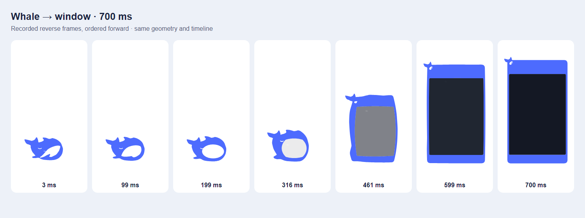

# 迭代记录

## v0.8.0（2026-09-22）

新增鲸鱼 ⇄ 悬浮窗的连续可逆变形：嘴部镂空张开，直立面板从嘴中长出，身体成为蓝色边框；白眼睛留在头部，尾巴伸出左上角。总时长 700ms，无翻转、无弹跳，真实内容在结束后显示。

### 上版问题与方法根因

- 原切换直接显示/隐藏两个原生窗口，收起另播破水浮出；两条路径没有共同进度或共同外形，无法无跳变倒放。
- 鲸鱼 SVG、悬浮窗 Vue 和原生 WebContentsView 分别绘制，单独给 Vue 加 CSS 动画不能带动聊天视图；动画和固定外壳各画一份也容易在交接时错位。
- 尾巴需要额外透明区域，若只移动 CSS 面板而不更新原生子视图矩形，会重新引入鼠标坐标偏移。

### 本版改进

- 共享原始 SVG 路径、弧长轮廓采样与画笔：嘴部先张开 200ms，再在 500ms 内变为窗口外壳；身体、嘴、眼睛、尾巴在同一进度上求值。镜像朝向先匹配轮廓方向和起点，反向仅改变时间轴方向。
- 主进程协调状态机负责准备、播放、交接和恢复；`id + revision` 丢弃迟到回执。同方向幂等、反方向立即倒放；所有形态入口（含 Usage 页、二次启动）统一接入。
- 鲸鱼透明窗兼作动画舞台；变形期间停止行为、拖拽、悬停与粒子，结束后恢复。新加就绪/绘制回执，使空外壳与真实浮窗交接；2 秒守卫和崩溃回退保持可用窗口。
- 原生窗口 384×644 DIP，内面板保持 360×620，聊天区保持 340×484；左/上 24 DIP 留给尾巴，HTML/原生布局共用偏移。位置文件继续保存内面板坐标，译文弹窗也依附内面板。
- 倒放路径随拖动平移，鲸鱼终点夹进当前显示器；鲸鱼窗口改为跟随当前显示器。透明留白按共享外形命中穿透；光标在窗口外时保持可交互，避免快速进入后首击被穿透开关吞掉。
- 保留原生站点视图，不为普通展开/收起卸载或重新导航；提示词模式在往返后保持。

### 验证结果

- `npm run typecheck` 通过，Vitest **219/219** 通过，`npm run build` 通过。
- 新测试覆盖：两端外形、独立坐标手算对照、100/200/450/699ms 反向、倒序求值等价、负坐标屏幕和边缘钳制、透明留白、迟到/错误来源回执、准备期取消、交接期反向、超时和渲染崩溃。
- 隔离用户目录 + 本地诊断网页的 Electron 实测：正放/倒放各录制逐帧 SVG，目视检查张嘴、外形连续、眼尾移动及最终外壳；多次中途反向后终态正确。
- 真实鼠标在窗内 `(132,294)` 点击，网页收到 `(98,186)`，与新子视图原点 `(34,108)` 精确相减一致；按钮命中和本地输入框键入成功。反复收起/展开后草稿与点击记录保留。
- 程序性移动浮窗后收起/展开成功；提示词模式往返保持；从鲸鱼形态经余额 Usage 入口展开并在原站点视图导航本地 Usage 页成功。
- 分别强制崩溃悬浮窗/鲸鱼渲染器，均回退到另一个可见窗口，并可再次切换。测试配置与真实用户目录隔离。

### 遗留问题与验证边界

- 本机只有一个显示器、100% 缩放；负坐标/跨屏路径已有数学与状态测试，真实多显示器、混合 DPI 和热拔插仍需设备实测。
- 原生标题栏拖动的自动化未观察到可靠位移结果，保留既有 `-webkit-app-region: drag` 实现；程序性移动和位置钳制已验证，真实拖动仍需人工复核。此项未计为通过。
- 工作区小于 384×644 时仍沿用窗口边界钳制策略，不缩小聊天内容。

### 实际采用的资料

- [Motion：animation controls](https://motion.dev/docs/animate)：参考可寻址时间轴和播放方向控制；使用现有基础设施实现，不引入依赖。
- [Heer & Robertson, Animated Transitions in Statistical Data Graphics (2007)](https://www.microsoft.com/en-us/research/publication/animated-transitions-in-statistical-data-graphics/)（DOI: 10.1109/TVCG.2007.70539）：作为保持对象视觉连续性的研究背景；不将其图表实验结论视为本桌宠动画的直接验证。
- 本项目移植自 whale-pet（本机来源 `E:\Projects\whale`） 的 SVG 和行为基础：复用既有鲸鱼轮廓及状态取消机制，原作定位记录保留。

## v0.7.1（2026-09-22）

修复（用户反馈）：Usage 页在悬浮窗内打开后"鼠标错位"——点击/拖动作用的位置和页面上看到的位置不符，页面需要横向滚动条调整时尤其明显。

### 上版问题

- v0.7.0 的 Usage-in-float 链路中，`ViewManager.navigate`/`reload` 对"尚无视图"的站点先 `loadURL` 再由渲染层挂载：WebContentsView 在**未挂载（零尺寸）状态**下加载内容，挂上窗口后视觉与输入的同步是概率性成立的。实测复现出一次"点了 Usage 按钮但窗格不切换"（厂商已创建、事件已送达、窗格停留在旧视图），用户侧表现即"显示的和实际交互的不一致/错位"。

### 方法（根因）

- 黑盒测量定位：本地诊断页（回显 `clientX/clientY`、`scrollX`、`innerWidth`）经真实 Usage 按钮链路加载进悬浮窗，用真实鼠标逐点比对"页面感知坐标 vs 光标物理位置"。修复后各场景（首次打开、切走再切回 ×3、窗口拖动、横向滚动后、滚动条拖动、元素级方块命中）映射全部精确到像素（如屏 (100,1100) → 页 (90,84)，与 `floatChatRect` (10,84) 推算值分毫不差）。
- 根因确认为**挂载与加载的顺序**：chat 站点视图（先挂载定尺寸、后加载）从无此问题；Usage 视图（旧 navigate 先加载后挂载）输入/显示脱同步概率性发生。修复把不变量固化进 `ViewManager.loadNow`：任何导航前必须已挂载且有尺寸，布局矩形未到达时先用最近一次布局的窗格矩形（`mountWithLastLayout`），渲染层随后的 `setLayout` 以同矩形幂等覆盖。`reload` 的视图缺失分支（同样先加载后挂载）一并修复。
- 排查中同时证伪了几个假设：鲸鱼窗口鼠标穿透（`setIgnoreMouseEvents` 默认开启，点击可达悬浮窗）、透明窗命中区偏移、DPI 换算（系统 100%）、窗口移动后输入区不跟随、滚动后命中区不跟随——均实测排除。

### 验证结果

- `npm run typecheck` 三工程通过；200/200 单测通过。
- 诊断页实测：修复前老代码复现一次窗格不切换；修复后同一链路三轮切换往返全部正常，坐标与元素级命中（20 方块页，滚动 1388px 后点击命中期望方块）精确。
- chat 视图回归：文心输入框真实鼠标点击+打字正常；窗格切换、滚动条拖动 1:1 跟手。

### 遗留问题

- 火山方舟控制台页（登录墙内）未直接实测，但该页面走同一视图链路，修复覆盖。
- v0.7.0 遗留照旧：代理 fake-IP 间歇网络故障、本机计量口径限制、账单窗口现场拉取趋势等。

## v0.7.0（2026-09-21）

新功能（用户需求）：余额监控加**账单**——在合理位置显示累计已用（不同币种分开、百分比站点不计），并新增**独立账单窗口**展示每月使用等明细；顺带修火山方舟 Usage 按钮失灵（用户点名要修），Usage 页改为**在悬浮窗内打开**（不再用系统浏览器），刷新时加闪烁动画反馈。

### 上版问题

- 数据模型只有"剩余余额"，没有"已用"：合计块在混合币种（用户实际 2 USD + 1 CNY）下整个隐藏，任何汇总都看不到；用户要"使用的总额度"与"每月使用明细"。
- **火山方舟 Usage 按钮失灵**（用户反馈，点名要修）：渲染层的站点描述表（`descriptions`）只在窗口创建时拉一次，添加站点后不刷新——新站点 `desc?.usageUrl` 为空，`openUsage` 根本不发起；同一根因还会让编辑新站点时表单字段全空。
- 火山方舟轮询间歇性失败（用户反馈"有概率报错，重开窗口才刷新，刚刚又好了"）：真实凭据复测正常（88.56% 已用 + 重置时间），判断为站点侧/时序问题，按用户指示先挂起。

### 方法（根因）

- **已用口径先做对账再定**（临时脚本实测真实站点，已删）：`/auth/me` 带 `total_recharged`/`frozen_balance`；用户侧用量接口从站点前端 bundle 逆向出来（`/usage/dashboard/stats`、`/usage/dashboard/trend?start_date&end_date`）。对账实锤：**`balance + total_actual_cost = 累计充值 + 赠送额度`（两站精确吻合），且逐日 trend 的 actual_cost 求和 == total_actual_cost（delta=0.0000）**——`total_actual_cost` 就是站点记账的真实累计已用（含赠送额度消耗，比"充值-余额"更准）。trend 支持任意日期区间，覆盖账号全部历史。
- **两条口径**（`balance/usage.ts` 新增 `UsageStore`，台账持久化 `userData/balance.usage.json`，与用户配置分文件——派生数据清掉即重计）：① api 口径：sub2api 每轮拉 stats 记下 `apiUsed`，接口临时故障时回退最近记账值（胶囊数字不来回跳）；② metered 口径（DeepSeek 无用量接口）：纯函数 `applyObservation` 按"余额下降量"计量——下降差额记到当日、上升视为充值不计、持平不落盘、负余额视为异常只重置基线、币种变化重开台账；计量对所有货币站点照跑（站点接口失效时的后备）。PCT 站点全程排除。调度器每轮成功观测后挂钩，状态快照新增 `used/usedSource`。
- **显示**：胶囊底部新增按币种的「已用 $x · ¥y」汇总行（no-drag，点击即开账单）；卡片合计块从"单币种才显示、混合币种整体隐藏"改为**按币种分行**「余额 … · 已用 …」；刷新中站点行加 `loading` 类走 1s 呼吸闪烁动画（配合 logo 自旋，让"点了刷新"有可见反馈）。
- **账单窗口**（第六渲染入口 billing.html + `billing-window.ts` + `billing.ts` 报告构建）：固定 460×620 无边框透明卡片，关闭即销毁；顶部按币种汇总（本月/累计），站点分区显示口径徽标（站点记账/本机计量）、累计已用、统计起始、近 6 个自然月逐月条形（api 站点打开时现场拉 trend 聚合），本机计量附估算说明；`balance:billing-get` 现拉现算。入口三处：卡片「账单」按钮、胶囊已用行、设置窗口「账单明细」。
- **Usage 页悬浮窗内打开**：`balance:open-usage` 重写——已有同源站点直接把该视图导航到 Usage 地址（登录态共享、不加标签）；没有则落一个「<站点名> Usage」厂商（桌面 UA——火山控制台在移动 UA 下布局损坏，`ProviderStore.save` 顺带放开自定义厂商的 userAgent 字段；独立持久分区登录一次长期有效，可删）。`forms.expandFloat()` 展开悬浮窗 → `ev:f-usage-open` 通知渲染层**补拉 provider 列表**后 navigate+activate；ViewManager 新增 `navigate(id,url)`（按视图状态机走合法转移后换页）。描述表陈旧修复：保存/删除站点后重新 `describeSites()`，Usage 按钮改为无条件发起、主进程校验兜底。
- 测试逮住一个真 bug：`applyObservation` 首次建基线时把"尚无观测（lastCurrency=null）"误判成币种变化，刚记的 `apiUsed` 立刻被清——修正为仅在"曾有观测且币种不同"时作废。

### 验证结果

- `npm run typecheck` 三工程通过；**200/200** 单测通过（178 + 用量/账单 21 + 集成断言 +1）。计量逻辑按规范独立对照（余额序列手工推演逐项一致、浮点漂移钳制 10→9.9→9.8=0.2）+ 边界（首观测/持平不落盘/零余额/负余额/跨日入桶/币种切换/窗口外日期）+ 反例（充值后再消耗只计净下降）。
- dev 冒烟（真实数据，截图逐环确认）：胶囊四行 + 「已用 $454.11 · ¥0.00」（USD=两站点记账合计，DeepSeek 自本轮起计量，火山 74% 已排除）→ 展开卡片合计按币种两行（USD 余额 $25.76 · 已用 $454.11 / CNY 余额 ¥7.52 · 已用 ¥0.00）→「账单」按钮 → 账单窗口真实月度明细（SpacetimeAI 8 月 $122.60/9 月 $37.29、Sub2API 8 月 $16.25/9 月 $277.51，均为站点记账；DeepSeek 本机计量 ¥0.00 起表；底部"百分比额度站点不参与账单统计:火山方舟"）→ 关闭按钮生效。
- **Usage-in-float 黑盒点击**：点火山方舟行 ↗ → 悬浮窗自动展开、新增「火山方舟 Usage」标签并激活、火山控制台 Coding Plan 页在窗格内渲染（桌面 UA；独立分区待登录一次）。主进程日志无错误。
- 临时探测/复现脚本全部删除，grep 临时=0；冒烟在真实配置上进行但未改动站点配置（新增的 Usage 厂商与 balance.usage.json 是功能自身的落地产物，保留）。

### 遗留问题

- **网络间歇性不可达（本次排查收获，用户"有概率报错"的根因方向）**：`spacetimeai.cc` 解析到 `198.18.0.12`、`open.volcengineapi.com` 解析到 `198.18.0.28`——198.18.0.0/15 是代理软件（Clash/Mihomo 类）fake-IP 模式的典型假地址，无 AAAA 记录；实测同一时刻火山经代理连通 113ms，而 spacetimeai.cc 连续 3 次 TCP 连接超时（UND_ERR_CONNECT_TIMEOUT 10.7s）——即**代理链路/规则的间歇性故障**，不是应用缺陷。已做的加固：账单趋势拉取失败重试一次（700ms），仍失败则回退本机计量并**显式标注**"站点用量接口暂不可用（数字可能低于实际）"；余额轮询的失败下轮自动重试照旧。若频繁出现，建议检查代理规则/节点。
- 火山方舟轮询间歇性失败未修（用户指示先不管）：与上条同源可能性大；真实凭据复测正常。
- 本机计量从安装日起算（DeepSeek 此前历史用量无法追溯）；充值与消耗同期发生时该段用量低估（口径说明已写进账单窗口）。
- sub2api 每轮多一个 stats 请求（5 分钟一次，量级可忽略）；账单窗口每次打开现场拉 trend（数秒）。
- v0.6.0 遗留照旧（Agent Plan 未接、AK/SK 权限粒度、ResetTimestamp 时区）；v0.5.0 遗留照旧。

## v0.6.0（2026-09-21）

新功能（用户需求）：余额监控新增**火山方舟 Coding Plan** 站点类型，显示每五小时（session 窗口）额度；并补上余额监控的**显性入口**（用户反馈：此前只能靠托盘勾选打开，悬浮窗/设置窗口里没有入口）。

### 上版问题

- 余额监控只有 sub2api 网关与 DeepSeek 官方两类适配器；用户订阅了火山方舟编码计划（console.volcengine.com/ark），希望在小窗里看到每五小时额度。
- 入口可发现性差：打开余额小窗的唯一路径是托盘右键勾选「余额监控」，悬浮窗头部与设置窗口均无入口（用户实测反馈"没有进入余额监控设置的入口"）。
- **胶囊完全点不动（用户反馈"无法添加/编辑站点"）**：`#pill` 本体是 `-webkit-app-region: drag` 拖拽区（拖动移动窗口用），Electron 拖拽区会吞掉一切鼠标事件——移植自原版的 `pill.click/contextmenu → expand` 监听从未生效过，v0.5.0 的"展开卡片全部可用"实际只经键盘/合成 click 验证，鼠标主路径是断的。

### 方法（根因）

- **协议调研**（无官方 SDK 文档，以两个开源实现交叉核实：dsh-ark-quota、ArkBar）：`POST https://open.volcengineapi.com/?Action=GetCodingPlanUsage&Version=2024-01-01`，空请求体；鉴权是火山引擎 SigV4 请求签名（service=ark、region=cn-beijing），凭据为「访问控制(IAM)→访问密钥」的 AK/SK——**不是**模型推理用的 Ark API Key；响应 `Result.QuotaUsage[]`（`Level: session/weekly/monthly`、`Percent` 已用比例、`ResetTimestamp` 秒），错误为 `ResponseMetadata.Error{Code,Message}` 信封。
- **适配器** `providers/volcark.ts`：`signVolcRequest` 独立纯函数实现 SigV4（派生链 HMAC(SK→日期→region→service→"request")）；只取 `Level='session'`（即五小时会话窗口，缺失回退第一条）；额度以 `currency='PCT'` 流转，与货币站点天然互斥。凭据复用 `accessToken`=AccessKeyId、`refreshToken`=SecretAccessKey 字段（`BalanceTokenField.key` 联合类型不改 IPC 即可承载两枚密钥，界面文案引导区分）。
- **PCT 显示适配**：`formatBalance` 抽到 `shared/balance.ts`（通知与渲染层共用一份，消除原 `money`/`fmtMoney` 双份实现）；胶囊值 `35%`、列表副行「五小时额度已用 X% · HH:MM 重置」（重置时间经 `BalanceResult.note` → 状态 `message` 流转，仅 ok 态展示）、悬停 tooltip 补"已用"语义；合计块排除 PCT 站点（百分比相加无意义）；`requestJson` 修复 content-type 合并策略（调用方自带时不注入默认值——SigV4 对 content-type 签名，双份合并必然 SignatureDoesNotMatch）。
- **入口**（共用新 IPC `balance:toggle`，`mode='show'` 表示幂等打开）：悬浮窗头部钱包按钮（toggle）、设置窗口「余额监控」区块（只打开）；托盘勾选态经既有 `onVisibilityChanged` 继续同步。
- **胶囊展开按钮**：`#pill` 保持拖拽区（拖动移动窗口），右缘新增 `#pillExpand`（no-drag 实体按钮）作为鼠标展开站点管理的唯一入口；另加 `[hidden]{display:none!important}` 兜底（author display 规则会压掉 hidden 的 UA 样式，表现为编辑已有站点时"站点类型"标签漏显示）。
- 图标补 simple-icons 的字节跳动路径（CC0）。

### 验证结果

- `npm run typecheck` 三工程通过；**178/178** 单测通过（163 + volcark 14 + 调度器/注册表 +1）。
- 签名独立对照：测试内按火山 SigV4 规范从零重推签名逐位一致；同输入签名确定、SK 变则变（反例）。
- **真端点冒烟**（临时脚本，已删）：假凭据请求真实 `open.volcengineapi.com` → HTTP 401 + `InvalidAccessKey`，信封回显 `Action=GetCodingPlanUsage/Service=ark/Region=cn-beijing`——服务端成功解析路由请求且**签名格式被接受**（签名错误会返回 SignatureDoesNotMatch），仅假 AK 不存在。
- dev 冒烟（临时钩子，已删，grep 临时=0）：注入假凭据 volcark 站点后真实拉取 → auth-error（预期），三个既有站点余额照常（SpacetimeAI 4.97USD / Sub2API 6.93USD / DeepSeek 7.52CNY，`requestJson` 改动无回归）；胶囊四行渲染正常。
- **真实鼠标点击链路**（SetCursorPos+mouse_event 黑盒点击 dev 实例，修复后逐环截图确认）：胶囊右缘按钮 → 管理卡片展开 ✓；点击站点行 → 编辑表单（名称/地址/图标/凭据留空保持/删除/返回齐全）✓；返回列表 →「+」→ 添加站点类型选择器含「火山方舟 Coding Plan」✓。修复前对照组：精确点击胶囊正中心无任何反应（复现用户反馈）。
- 用户配置零污染：真实 `balance.user.json` 先备份再注入假站点，验证后恢复（3 站点原样）。

### 遗留问题

- 火山方舟仅接了 Coding Plan（GetCodingPlanUsage）；Agent Plan（GetAFPUsage，近5小时/周/月三窗口）未接，有订阅需求再加。
- AK/SK 权限粒度未细分：IAM 密钥缺方舟只读权限时同样落入 auth-error，文案提示"检查 AK/SK 或权限"。
- `ResetTimestamp` 服务端时区假定为 UTC 秒（按两个开源实现一致处理）；如遇重置时间偏差需再核对。
- v0.5.0 遗留照旧（刷新间隔不暴露、凭据明文 JSON、小窗崩溃不自动重建等）；v0.4.0 遗留照旧。

## v0.5.0（2026-09-21）

功能合并（用户需求）：把 token-balance 的余额监控合并进 ChatDeck——新增一个**独立**的余额小窗，与悬浮窗/鲸鱼形态系统无关，托盘右键菜单开关显隐。已确认：外观原样保留、现有站点与 token 一次性迁移、默认隐藏并记住上次状态。

### 上版问题

- 用户另有一个成型的余额监控小工具（token-balance：轮询 sub2api 网关与 DeepSeek 官方余额，胶囊 + 站点卡片），希望并进 ChatDeck 一起用，而不是再单独跑一个程序。
- token-balance 的配置写在项目根 `config.json`（`__dirname/../..`）——合并进打包应用后该路径落在 asar 内只读，窗口位置记忆与 sub2api token 轮换写回都会失败；且它自带托盘与开机自启项，与 ChatDeck 的同类入口冲突。

### 方法（根因）

- **忠实移植，只改落地方式**：主进程逻辑（配置读写/协议适配/调度器/通知）TS 化到 `src/main/balance/`，渲染层（胶囊/列表/编辑卡片、尺寸自适应、样式）原样移植到 `src/renderer/src/balance/`（纯 TS，无 Vue，与 whale 同风格）；新增第五个渲染入口 `balance.html`。
  接缝改动逐条：配置改存 `userData/balance.user.json`（`BalanceStore` 以文件路径为构造参数，测试注入临时目录；写入改为临时文件 + rename 原子替换）；IPC 通道加 `balance:` / `ev:balance-*` 前缀；窗口层级从 `screen-saver` 统一为 `floating`；去掉自带托盘与开机自启项（ChatDeck 已有）；渲染层去掉"浏览器直接打开时的 Mock 预览"分支（避免 preload 失效时静默显示假数据）。
- **独立窗口**：`BalanceWindowController`（惰性创建、`showInactive()` 不抢焦点、位置记忆 + 拖动过程屏幕内硬约束 + 反 Aero Snap + 按渲染层内容自适应尺寸，全部沿用原版行为）；显隐由托盘菜单 checkbox「余额监控」控制，勾选态经 `onVisibilityChanged` 回写，显隐状态持久化、下次启动恢复（默认隐藏）。
- **轮询常驻主进程**：默认 5 分钟（1–60 钳制）、窗口隐藏照常刷新、状态切换沿发系统通知（Token 失效 / 余额恢复）；调度器改为实例（原为模块级单例），配置存储由组合根注入，`describeAll(store)` 显式接收存储，摆脱原测试脚本对 `Module._resolveFilename` 的补丁。
- **适配器契约不变**：`ProviderError` 四种错误 kind（setup/auth/network/api）驱动每站点状态机；sub2api 401 → refresh 轮换新 token 写回站点 → 重试一次；DeepSeek 官方 `/user/balance` 币种随响应返回。凭据只在主进程，`describe*` 交给渲染层的对象不含凭据（有序列化断言测试）。
- **凭据迁移（一次性手工操作，不进仓库）**：把 token-balance 现有 `config.json` 的 3 个站点（SpacetimeAI、Sub2API、DeepSeek，含 access/refresh token）写入 `%APPDATA%/chatdeck/balance.user.json`；窗口位置不迁移（新窗口落默认位），显隐初始为 false。

### 验证结果

- 回归：`npm run typecheck` 三工程通过；**163/163** 单测通过（原 127 + 移植 36）。
- 移植测试（原脚本 → vitest，共 36 例）：两个协议的成功/嵌套/平铺形态、余额 0 与字符串余额、code≠0、字段缺失、非 JSON、401→续期→重试、续期失败、凭据缺失；旧格式配置无损迁移、interval 钳制、窗口状态持久化、四站点混合类型并行轮询与独立状态机、断网/停用、保存校验（重复地址/非法地址/留空保持）、删除、类型注册表、描述对象不含凭据。
- dev 冒烟（临时钩子，验证后已删，grep 临时=0）：三个迁移站点**真实拉取成功**（SpacetimeAI 4.97 USD / Sub2API 12.76 USD / DeepSeek 8.42 CNY）；默认隐藏 → `show()` 后可见且窗口按内容自适应为 200×112（说明渲染层渲染了 3 行胶囊并走通 resize 通道）→ `hide()` 生效；鲸鱼照常启动，无回归。
- 打包：v0.5.0 双包 68.1/68.3MB（与 v0.4.0 持平，仅多一个几十 KB 的渲染入口）；asar 五入口齐全、`resources/balance-icon.png` 就位；打包版冒烟：把 `visible` 临时置 true 后启动，**EnumWindows 确认「ChatDeck 余额」可见且尺寸 200×112**、「ChatDeck 鲸鱼」可见、「ChatDeck 悬浮窗」隐藏；随后恢复默认隐藏并重启留给用户试用。

### 遗留问题

- 刷新间隔仍只改 `balance.user.json`（界面不暴露，与原版一致）；托盘只加开关一项，「立即刷新/站点管理」在窗口内（右键胶囊直达管理）。
- 托盘 tooltip 未接管「X/Y 站点正常」（保持 ChatDeck）；品牌文案「Token Balance」按"原样保留"决定未改。
- 凭据为明文 JSON（与原版一致）；文件在 userData 内、不入仓库。
- 余额小窗渲染进程崩溃后不自动重建（原版亦无），下次开关窗口即重建；如需与悬浮窗同级的重建守卫可后续补。
- v0.4.0 遗留照旧（鲸鱼单主显示器策略、未读气泡潜水期不显示等）；v0.3.7/0.3.6/0.3.5 遗留照旧。

## v0.4.0（2026-09-20）

形态升级（用户需求）：把 whale-pet 小鲸鱼桌宠作为悬浮窗的**压缩形态**——鲸鱼完全取代 148×64 药丸。本轮只做合并，不改两个项目各自的功能（仅 4 处经用户确认的集成胶水）。

### 上版问题

- 折叠态（药丸）信息密度低、纯静态：只有一点呼吸动画，白占桌面又无表现力。
- 用户已有一个成型的鲸鱼桌宠项目（whale-pet，含完整行为状态机/物理/粒子/性能优化与测试），希望复用它作为压缩形态，而不是继续维护药丸。

### 方法（根因）

- **整体策略：渲染层照搬 + 接缝做胶水**。鲸鱼的窗口规格、行为脚本、物理常量、渲染优化全部保留；ChatDeck 只提供宿主（窗口/IPC/形态编排），不改造鲸鱼逻辑。
- **窗口**：新增 `WhaleWindowController`（`src/main/whaleWindow.ts`），规格与 whale-pet 一致——透明无边框窗口覆盖主显示器工作区、默认鼠标穿透（`setIgnoreMouseEvents(true, {forward:true})`）、渲染层 hitTest 命中鲸鱼/气泡才接管鼠标、渲染层就绪（`whale:ready`）后再显示、33ms 光标轮询（未变化不发送）、`display-metrics-changed` 跟随工作区。透明窗口自愈（resume/unlock/GPU 崩溃 → `heal()`）与悬浮窗同款。
- **渲染层移植**：`src/renderer/src/whale/` 下 9 个纯 TS 模块（app/states/whale/particles/runtime/tween/fsm/context/badge），逐行移植原 JS（仅有条件类型化与模块化，例如全局对象改显式导入、`window.CFG` 改 `shared/whaleConfig.ts` 类型化配置、App 数据单例拆出 `context.ts` 解循环引用）。新增 `whale.html` 第四渲染入口。
- **删药丸**：`FloatPill.vue` 及其尺寸常量、`float.resize` 通道、`floatStore.expanded` 状态删除；悬浮窗只有展开态。悬浮窗改为**启动即隐藏创建**（`ensureCreated`），渲染层保持存活以维持站点加载/未读统计/快速展开；ready-to-show 由 `wantVisible` 决定是否自动显形（隐藏创建不闪窗）。
- **四点胶水**（用户逐条确认，其余行为零改动）：
  1. 单击鲸鱼 → 展开悬浮窗（原「开心跳」让位）；快速点击判定沿用原输入会话（<350ms、<10px），拖拽/投掷不变。
  2. 鼠标悬浮鲸鱼 → 触发「开心跳」（悬停上升沿、非按压、非 jumpDive/surface）。
  3. 头顶未读气泡（药丸红点的等价物）：数据源是悬浮窗渲染层的 `providers.unread`，经新通道 `float:unread-count` 推给主进程转发 `ev:whale-unread`；气泡位置每帧跟随、可点击展开、计入交互接管区。
  4. 新增 `surface` 行为状态（定点破水浮出）：收起悬浮窗时主进程取窗中心屏幕坐标下发，鲸鱼在原位置浮出——复用招牌动作的入水/浮出编排。
- **形态编排**（`index.ts`：`expandFloat` / `collapseToWhale` / `toggleForm`）：两窗口互斥显示；展开时把鲸鱼姿态换算成屏幕锚点（水平居中、顶部在鲸鱼上方约 120px，`clampPoint` 夹进工作区）落位悬浮窗；收起时悬浮窗隐藏 + 鲸鱼显示 + surface。入口统一为：鲸鱼单击（`whale:expand`）、头部收起按钮/隐藏按钮（`float:collapse`，隐藏=收起为鲸鱼）、托盘「悬浮窗 ⇄ 鲸鱼」与托盘左键、二次启动（唤起鲸鱼）。
- **托盘**：新增「鲸鱼招牌动作（起跳下潜）」（仅鲸鱼可见时下发）。
- **测试工程**：新增 `tsconfig.test.json`（DOM + node 类型），把 `tests/**` 从无 DOM 的 `tsconfig.node.json` 移出——鲸鱼渲染层被测试引用后原配置无法通过类型检查；`typecheck` 脚本追加第三段。

### 验证结果

- 移植保真：whale-pet 的 `runtime.test.js` / `animation.test.js` 全量移植到 vitest（`tests/whaleRuntime.test.ts` 18 例 + `tests/whaleStates.test.ts` 8 例），用独立对照与边界用例校验。移植期抓到 2 个抄写缺陷并修正：`DampedSpring` 欠阻尼速度公式（`s` 位置错）与我移植的 RK4 对照第四阶段位置项（`v + b·dt` 应为 `v + b·dt/2`）——前者被后者放大暴露，比对原版后双向确认。修正后 **127/127 通过**。
- `npm run typecheck`：node/web/test 三工程全通过。
- dev 冒烟（临时钩子，验证后已删，grep 临时=0）：启动即鲸鱼可见 + 悬浮窗隐藏；钩子展开 → 悬浮窗按鲸鱼位置落位（实测 x=588,y=932）且鲸鱼隐藏；**用户手动切换**回鲸鱼成功；钩子收起 → 鲸鱼保持可见（幂等）。鲸鱼渲染层 `[whale] booted` 日志正常，无报错。
- 打包：v0.4.0 双包 68.1/68.3MB（与 0.3.7 持平：仅多一个渲染入口，组件本体共用）；asar 四入口齐全（whale/float/settings/translate.html + whale JS/CSS 资产）；打包版启动冒烟通过——EnumWindows 显示「ChatDeck 鲸鱼」可见、「ChatDeck 悬浮窗」隐藏，正是设计的启动形态。

### 遗留问题

- 鲸鱼窗口覆盖整个工作区且置顶（鼠标穿透），沿用 whale-pet 的单主显示器策略：鲸鱼只在主显示器游动，不外溢到副屏。
- 悬浮窗隐藏创建后，站点视图在「鲸鱼形态」下按休眠策略被销毁（与旧版隐藏悬浮窗行为一致），久留鲸鱼形态后展开会重新加载站点页面。
- 未读气泡在鲸鱼潜水（jumpDive 水下段/窗口重建间隙）期间不显示，浮出后恢复。
- 悬停触发开心跳是每帧 hitTest 的上升沿：鲸鱼游到静止光标下方时也会触发（用户明确要求的语义），若嫌频繁可在后续版本加冷却时间。
- v0.3.7 遗留照旧：portable exe 移动后自启路径失效需重开关一次；开机瞬间网络未就绪可能落错误页。
- v0.3.6 遗留照旧：粘贴目标只认悬浮窗活动站点、360 窄面板移动端 UA 策略；v0.3.5 及更早遗留照旧。

## v0.3.7（2026-09-20）

新功能：开机自启（用户需求）。

### 上版问题

- ChatDeck 以常驻悬浮窗形态运行，但每次开机需手动启动；用户要求支持开机自启。

### 方法（根因）

- 走 Electron 内建 `app.setLoginItemSettings`：Windows 落在 `HKCU\Software\Microsoft\Windows\CurrentVersion\Run`，值指向当前 exe。不引第三方依赖、无安装器改动（NSIS 与 portable 通用）。
- 设置窗口新增「通用 → 开机自动启动」开关（默认关闭，用户自选）：`app:get/set-autostart` IPC，写入后以 `getLoginItemSettings().openAtLogin` 回读为准（注册表可能被安全软件拦截）。开关状态不另存配置文件——注册表即事实源，避免双源不一致。
- 已知约束：portable exe 移动位置后注册表路径失效，需在设置里重新开关一次刷新；开机自启启动即显示悬浮窗（与手动启动行为一致）。

### 验证结果

- 回归：typecheck 通过；102/102 单测通过。
- dev 临时钩子锤击（验证后已删除，grep 临时=0）：`setLoginItemSettings(true)` → API 回读 `openAtLogin=true` 且 HKCU Run 出现对应注册表项 → 15s 后自动 `setLoginItemSettings(false)` → 回读 `false` 且注册表项消失，往返干净。
- 打包：v0.3.7 双包 68.1/68.3MB（与 v0.3.6 持平）；打包版启动冒烟通过（仅悬浮窗一个可见窗口）。

### 遗留问题

- portable exe 移动/重命名后自启路径失效（表现：开机不自启），需重新开关一次；NSIS 安装版无此问题。
- 开机瞬间网络可能未就绪，站点首次加载可能落到错误页（现有重试按钮可恢复），未做启动延迟。
- v0.3.6 遗留照旧：粘贴目标只认悬浮窗活动站点、360 窄面板移动端 UA 策略；v0.3.5 及更早遗留照旧。

## v0.3.6（2026-09-20）

形态重构（用户需求）：悬浮窗为主形态——启动默认显示悬浮窗、删除大主窗界面、设置等入口移到托盘右键菜单。

### 上版问题

- 产品形态仍是「主窗 + 悬浮窗」双宿主：主窗常驻一个完整渲染层（侧栏/工作区/抽屉），内存与维护成本高；悬浮窗才是用户高频入口。
- 用户需求明确：默认显示悬浮窗、删除大界面、设置等放托盘右键。

### 方法（根因）

- **删除主窗**：`index.ts` 不再创建 `BrowserWindow` 主窗、删除主窗侧 `ViewManager` 实例与其 emit 桥；`floatViews` 成为站点视图唯一宿主。IPC 剪除主窗专属通道（`view:set-layout/set-active/reload/back/forward/open-external/paste`、`state:get/save`、主窗事件 `ev:title-changed` 等），`StateStore`（ui-state.json）、`stores/layout.ts`、`shared/layout.ts`、`App.vue`/`Sidebar`/`Workspace`/`Drawer` 及 `index.html` 入口整体删除。托盘左键与二次启动改为唤起悬浮窗；`window-all-closed` 改为 no-op（托盘常驻应用，防悬浮窗崩溃重建间隙误退出），退出只走托盘「退出」。
- **设置窗口**：新增 `settingsWindow.ts`（普通有框窗口 880×660，惰性创建、关闭即销毁、已开则聚焦），渲染层新入口 `settings.html` + `settings/SettingsApp.vue`（顶部「设置 / 提示词库」标签页，复用原 Drawer 下的 SettingsPanel/PromptPanel/PromptEditor/PromptFill 组件与 stores，并承载原 Workspace 的 toast 展示）。入口三处：托盘「设置…」（新增菜单项）、悬浮窗头部齿轮按钮、`app:open-settings` IPC。
- **悬浮窗补齐原主窗能力**：头部厂商点显示未读小红点（`providers.unread`，标题变化接线、切回即清）；`Ctrl+1~9` 切换站点迁移到悬浮窗渲染层；提示词「粘贴」目标改为悬浮窗当前活动站点——新增 `fview:paste`（无参，主进程经 `floatWin.getActiveProvider()` 解析，`FloatWindowController` 补 getter），设置窗口里的 PromptPanel/PromptFill 走此通道。
- 顺手修正文案：翻译热键错误提示与 translateService 提示不再指"主窗口"。

### 验证结果

- 回归：typecheck 通过；102/102 单测通过（118 − 已随 layout store 删除的 16 个布局用例，无新增纯逻辑）。
- dev 冒烟：启动仅 5 个 electron 进程，唯一可见窗口「ChatDeck 悬浮窗」（Win32 EnumWindows 核实），主窗不复存在；临时钩子驱动 `settingsWin.show()` →「ChatDeck 设置」窗口出现、渲染进程 5→6、用户目视确认内容渲染正常（钩子验证后已删除，grep 临时=0）。
- 打包：v0.3.6 双包 68.1/68.3MB（与 v0.3.5 持平——删除的主窗渲染层本就由同一份组件代码打包，入口减少但组件仍在，体积不变在预期内）；打包版启动冒烟通过（进程/窗口级：仅悬浮窗一个可见窗口，主窗不复存在）。

### 遗留问题

- 提示词「粘贴」目标只认悬浮窗当前活动站点；悬浮窗折叠（药丸）时站点视图零矩形挂载仍可粘贴，但若活动站点已被休眠则先重建加载、粘贴可能落在加载完成的输入框之前（罕见时序，遇到时先展开悬浮窗等待加载完成）。
- 悬浮窗 360×620 窄面板适配移动端 UA 站点；个别站点移动端布局异常时暂无桌面宽版选项（悬浮窗 UA 策略不变）。
- v0.3.5 遗留照旧：休眠丢失页面运行状态（草稿/滚动）、后台音频中止、孤儿分区磁盘清理未做；v0.3.4/v0.3.3/v0.3.1 遗留照旧。
- `ui-state.json` 为历史残留文件，应用不再读写，可手动删除（未做启动清理）。

## v0.3.5（2026-09-20）

性能优化：内存为主（后台站点自动休眠 + 删除站点彻底清理），兼顾 CPU（逐帧磁盘读写消除）与 GPU（药丸辉光合成器化）。

### 上版问题

- 站点视图（WebContentsView）一旦打开永不销毁：`setLayout` 只 detach 保留缓存、悬浮窗隐藏用零矩形常驻挂载、`views` Map 无上限。每个站点渲染进程 100~300MB，久跑内存持续增长。
- 删除自定义站点只改 `providers.user.json`：两侧视图与 `persist:provider-<id>` 分区存储全部残留（自定义 id 带时间戳，同名重建生成新分区，旧分区成永久孤儿）。
- `ViewSetLayout` 每次调用 `ensureProviders → providers.list()` 都重读 `providers.user.json` + JSON.parse + merge；而 `layout.sync()` 在窗口缩放的每个 ResizeObserver tick 都触发——拖拽缩放窗口 = 每帧一次磁盘读。
- 悬浮药丸辉光直接动画 box-shadow（无法合成器加速），透明置顶窗口全天持续重绘；翻译弹窗首次使用后隐藏常驻不销毁，多占一个渲染进程。

### 方法（根因）

- **后台站点自动休眠（核心，用户确认默认值）**：`Provider` 增 `autoSleepMinutes`（0=永不；`providers.default.json` 内置默认 DeepSeek=0、其余=5；用户层可覆盖、自定义站点缺省回退 `DEFAULT_AUTO_SLEEP_MINUTES=5`）。`ViewManager.sweepSleep()` 每 60s 扫描两个管理器：可见（非零矩形挂载 且 宿主窗口可见未最小化）→ 刷新时间戳；不可见超过该站点阈值 → `discardView` 销毁 webContents（摘除→延迟 close→删 Map→广播 `sleeping`，clearData/删除站点/休眠三路共用）。状态机增 `sleeping` 态 + `sleep` 事件（`shouldSleepNow` 纯函数：可见放行、阈值 ≤0 永不休眠）。切回时 `ensureView` 自动重建重载——登录态保留在 persist 分区，页面运行状态（滚动/草稿）丢失。窗口 `show`/`restore` 时按 `lastLayout`（最近一次 setLayout 快照）自动重建被休眠视图，防止托盘唤回主窗后窗格空白。`render-process-gone` 加 `views.get(id)===mv` 守卫，防销毁瞬间误报 crashed。
- **删除站点彻底清理**：`ProvidersRemove` 确认删除生效（自定义站点；内置删除是 no-op 不误清）后，两侧 `discardProvider`（销毁视图+忘记注册）+ `providers.clearData`（清分区存储/缓存）；`viewManager.clearData` 原与 `providerStore.clearData` 重复清两次存储的路径去除。
- **CPU**：`ProviderStore.list()` 结果内存缓存（save/remove/init 失效），消除每帧磁盘读；`ProvidersSave`/`ProvidersList` 把最新快照同步注册进**两个**管理器（原先 floatViews 持过期快照，改休眠阈值/UA 对悬浮窗不生效）。
- **GPU**：药丸辉光改静态 box-shadow（`::after` 伪元素承载）+ 仅动画 opacity，视觉不变、合成器友好。
- **其他**：站点视图 `spellcheck: false`（省词典下载/内存）；翻译弹窗隐藏后再闲置 10 分钟销毁窗口、下次划词重建（lastState 存主进程不丢失）。
- **设置界面**：每站点行内「后台休眠」下拉（不休眠/1/5/10/15/30/60 分钟），即改即存、注册同步后双窗口立即生效。

### 验证结果

- 回归：typecheck 通过；118/118 单测通过（新增：sleep 状态转移与越权事件、`shouldSleepNow` 边界（阈值 0/可见/恰达阈值）、`effectiveAutoSleepMinutes` 回退、ProviderStore 合并 + 缓存失效读盘打点、ViewManager 休眠扫描 electron 打桩集成 5 例）。
- **dev 自动化锤击**（临时 bootstrap 钩子驱动真实 `setLayout` 时间线，验证后已删除，grep 临时=0）：boot 挂 DeepSeek → +8s 切 Kimi（DS 转后台）→ +16s 切 ChatGLM（Kimi 转后台）。基线 4 渲染进程 / 总私有内存 **735.3MB**（DS 61.2 + Kimi 167.1 + ChatGLM 195.2 + 主页 32.7）；休眠扫描日志逐分钟正确（`deepseek threshold=0min` 永不休眠、`kimi threshold=5min` 递增）。约 6 分钟 Kimi 渲染进程退出：3 渲染进程 / 总私有内存 **533.8MB**，**净释放 ~201.5MB**，DS 与 ChatGLM 存活、主进程稳定。
- **remount 锤击**：隐藏窗口 → 挂载 kimi → 强制超阈值 sweep（kimi 与原活动站点均休眠销毁）→ `win.show()` → 日志确认按 lastLayout 自动重建 kimi 视图并重新加载。托盘唤回主窗不再出现空白窗格。
- 打包：v0.3.5 双包 68.1/68.3MB（与 v0.3.4 持平，本版为行为优化无体积变化）；afterPack 裁剪正常（locales 39.3MB + swiftshader/vulkan 6.1MB）；打包版启动冒烟通过（7 进程 / 2 渲染进程 = 主页 + 恢复的活动站点视图，总私有内存 509MB，进程级验证，UI 级以 dev 锤击为准）。
- 用户观察记录：验证期间用户报告"首次启动 LLM 页面盖住左侧栏"——经查为当时仍在运行的**临时验证钩子**把测试视图挂在 x:0 所致（原生视图层级高于 HTML），非产品代码问题；产品矩形由渲染层按工作区计算（boot 日志 `deepseek:1188x783` = 1440 − 侧栏 252），临时代码清除后干净启动无此现象。

### 遗留问题

- 休眠销毁的是"页面运行状态"：站点内未发送草稿、滚动位置、SPA 内页状态在休眠后丢失（登录态保留）。若某站点用户依赖草稿，可在设置中把该站点设为「不休眠」。
- 后台音频：被休眠/前台切走的站点若在播放音频，休眠会中止播放（预期行为）；未做"播放中禁止休眠"检测，待用户反馈再议。
- 孤儿分区磁盘清理（历史版本删除站点遗留的 `Partitions/provider-*` 目录）未做自动回收，可后续在启动时比对 provider 清单清理。
- v0.3.4 遗留照旧：heal 仅覆盖已知事件，真实过夜锁屏场景待用户日常验证；v0.3.3 遗留（SwiftShader 回滚开关、dev 图标、watcher 补丁锚点）与 v0.3.1 遗留（~68MB Electron 地板、跨显示器钳制细节）照旧。

## v0.3.4（2026-09-19）

修复：悬浮窗久跑自动消失、托盘右键唤醒失败（切到桌面再唤醒才有效）。

### 上版问题

- 用户报告：运行时间久了之后悬浮窗自动消失；从托盘菜单唤醒失败；切到桌面再唤醒才有效。

### 方法（根因）

- **根因**：悬浮窗是无边框**透明**窗口。Windows 上锁屏/休眠唤醒/显卡驱动重置后，DWM 对这类窗口的合成表面可能失效——窗口对象完好、`isVisible()` 仍为 true，但整窗透明不可见（=“消失”）。此时托盘「显示/隐藏悬浮窗」toggle 第一击反而执行了 hide；再 show 也不重绘（=“唤醒失败”）。切换桌面/Win+D 强制 DWM 重新合成，窗口“恢复”（=“切到桌面再唤醒才有效”）。伴生问题：'floating' 置顶级别也可能在同类事件后丢失，窗口被普通窗口压住。
- **修复四层**：
  1. `show()` 硬化：每次显示重新断言 `setAlwaysOnTop(true, 'floating')`，并 `webContents.invalidate()` 强制重绘；页面已崩溃（`isCrashed()`）时直接走窗口重建。
  2. 事件自愈 `heal()`：`powerMonitor` 的 resume / unlock-screen、GPU 进程崩溃（`app.on('child-process-gone')`）触发 hide→show 重建合成表面 + 重新置顶 + 强制重绘（窗口隐藏时不打扰）。
  3. 页面崩溃自动重建：悬浮窗自身 `render-process-gone` → 10s 节流（`RECREATE_GUARD_MS`，防崩溃循环）→ 销毁重建窗口；重建前 `onDetachViews`（= `floatViews.setLayout([])`）把站点视图从旧窗口摘下留缓存，新页面 boot 后 `floatStore.sync → FViewSetLayout` 自动重挂，位置尺寸从旧窗口 bounds 恢复。
  4. 显示器拓扑自愈：`display-removed` / `display-metrics-changed` → `reclamp()` 把窗口夹回现存工作区（防窗口留在已断开的显示器上）；`setVisibleOnAllWorkspaces(true)` 保证虚拟桌面切换/全屏应用不丢胶囊。

### 验证结果

- **dev 锤击**（临时注入 Ctrl+Shift+K → `webContents.forcefullyCrashRenderer()`，验证后已删除）：崩溃 → 旧窗销毁 → 新窗口**同位置同尺寸**自动重建（window_id 1510448 → 1575984），electron 进程与主窗存活；采样新窗口内容区像素为站点页面深色系（非 float.html 米色底 #FAF9F5），证明站点视图已随新窗口重挂。
- 回归：typecheck 通过；95/95 单测通过；清除临时代码后再次 typecheck 通过。
- 打包：v0.3.4 双包 68.1/68.3MB（与 v0.3.3 持平，本版为行为修复无体积变化）；打包版启动、进程/窗口枚举正常。
- 打包冒烟说明：验证期间用户正在使用机器（前台为资源管理器窗口），UI 级点击/像素采样被干扰，故打包版冒烟止步于进程/窗口级，交互级验证以 dev 锤击为准；托盘唤醒路径与 v0.3.3 冒烟一致（toggle → show，show 内部新增的两个调用不影响路径结构），待用户日常使用确认。

### 遗留问题

- `heal()` 只在已知事件（锁屏/解锁/GPU 崩溃/显示器变化）后触发；若存在其他导致透明表面失效的路径（如驱动热重置不经 GPU 进程重启），仍需切桌面恢复——真实长时间运行场景（锁屏/休眠过夜）待用户日常使用验证。
- v0.3.3 遗留照旧：已放弃 SwiftShader 兜底（虚拟机/RDP 白屏可从 afterPack `DROP_RUNTIME` 回滚）；dev 任务栏 electron.exe 默认图标、watcher 补丁锚点、v0.3.1 各项。

## v0.3.3（2026-09-19）

打包产物删除 SwiftShader/Vulkan 软件渲染兜底文件，exe 再减 ~1.5MB（v0.3.2 遗留项落地）。

### 上版问题

- v0.3.2 分析结论待定夺：删 `vk_swiftshader.dll` / `vk_swiftshader_icd.json` / `vulkan-1.dll` 对有 GPU 的机器零性能影响，可再省体积；用户确认删除。

### 方法（根因）

- `build/afterPack.js` 新增 `DROP_RUNTIME` 清单（`vk_swiftshader.dll`、`vk_swiftshader_icd.json`、`vulkan-1.dll`），打包后、压缩归档前删除，便携包/安装包同步受益（解压共释放 6.1MB，压缩后每包约 -1.5MB）。
- `d3dcompiler_47.dll` 明确保留：正常 GPU 渲染路径（ANGLE → D3D11）运行时编译着色器必需，删除会让所有机器渲染异常。
- 版本 bump 至 0.3.3：v0.3.2 的 exe 已交付，避免同名不同内容的两份产物。

### 验证结果

- win-unpacked 抽查：三个文件已消失，`d3dcompiler_47.dll`/`libEGL.dll`/`libGLESv2.dll`（ANGLE）完整，locales 仍为 2 个 .pak。
- 打包冒烟：`dist/win-unpacked/ChatDeck.exe` 启动 → 主窗与 Kimi webview 完整渲染（GPU/ANGLE 路径无恙）；侧栏"悬浮窗"按钮触发 → 折叠胶囊（148×64）在保存位置正常显示（透明窗口合成正常）。
- 体积实测：Portable 69.6 → 68.1MB，Setup 69.8 → 68.3MB（v0.3.0 起累计 78.2 → 68.1，−13%）。
- 回归：typecheck 通过；95/95 单测通过。

### 遗留问题

- 已放弃的兜底：GPU 进程崩溃后无法软件渲染续命（渲染异常需重启应用）、无 Vulkan 驱动的机器上 WebGPU 不可用、RDP/无 GPU 虚拟机可能白屏。若用户在虚拟机/RDP 场景遇到白屏，从 afterPack 的 `DROP_RUNTIME` 移除对应条目重打包即可回滚。
- v0.3.2 遗留照旧：dev 任务栏 electron.exe 默认图标、watcher 补丁锚点随大版本升级需人工重对；v0.3.1 遗留照旧：~68MB Electron 地板、垂直双屏向下跨屏被钳、顶部任务栏 8px 条带、v0.3.0/v0.1.x 各项。

## v0.3.2（2026-09-19）

应用图标重设计（黑底亮蓝原子轨道）+ 根治 dev watcher 写空 out/main 的问题。

### 上版问题

- 用户报告：悬浮窗收缩态可拖进任务栏底下且无法取回（v0.3.1 已修）。
- 用户报告：electron-vite dev watcher 偶发把 out/main 写空、报 "No electron app entry file found"，重启 dev 才恢复（本版开发期间遇到两次）。
- 用户要求：图标由橙白配色换成黑+蓝，最终明确为"参考 Electron 默认运行时标识（dev 任务栏/标题栏显示的那个）做新颖时尚的再设计"。

### 方法（根因）

- **图标**：`scripts/make-icon.mjs` 重写——深空径向渐变圆底 + 单条主轨道（被两个断口分为两段弧）+ 断口处两颗带柔光的电子（右上/左下对角）+ 中心亮核；轨道线色沿世界纵向做青蓝→蓝→蓝紫渐变；辉光一律平方衰减，不做硬边色块。负空间充足，小尺寸（托盘 16px）仍可读。
- **watcher 根因**（本版实测复现确认）：rollup watch 对失败/空重建会把上一轮产物**删除**（out/main/index.js 消失，语法错误注入实验复现）；electron-vite 的 watchHook 在重建结束后**无条件** kill+重启 electron，`startElectron` 内 `ensureElectronEntryFile` 在入口缺失时直接 throw → dev 会话死亡。
- **watcher 修复（两层）**：
  1. `electron.vite.config.ts` 给 main/preload 加 `build.watch.buildDelay: 400`——快速连续编辑合并为一次重建，消灭"背靠背重建竞态"这一触发条件；
  2. 新增 `scripts/patch-electron-vite.mjs`（package.json postinstall 自动执行、幂等）给 electron-vite 两份 chunk（ESM/CJS）打补丁：watchHook 重启 electron 前检查入口产物，缺失则跳过本次重启并告警（当前 electron 继续用旧代码跑，下一次有效重建正常重启）——空重建即便发生也只是"慢半拍"而非死亡。

### 踩坑

- **图标绘制单位混用**：电子/核的半径常量是相对值（0.038），绘制时直接与像素距离比较 → 两个"点"分支从未命中，前几版图标只有轨道没有点。排查手段：按公式计算电子应在的像素坐标、反读 PNG 采样值对照。教训：几何渲染里"相对单位/像素单位"必须显式换算。
- patch 锚点里的 `\n` 是 chunk 源码中的字面反斜杠+n（日志字符串），模板字面量会把它变成真换行导致锚点失配，需 `\\n`；补丁脚本对锚点失配做警告软失败，不阻塞 npm install。
- 主构建产物经 esbuild 压缩，源码注释不会进入 out/main/index.js——锤击测试用注释留痕验证产物时，grep 恒为 0 属预期。

### 验证结果

- 图标：`build/icon.ico`（7 尺寸）+ `icon-256.png` 预览人工确认（轨道断口、双电子、亮核、渐变、辉光均正确渲染）；`resources/tray.png`、`tray@2x.png` 同步再生。
- watcher 锤击：10 次快速交错编辑（main+shared 混合）→ 恰好合并为 1 次重建（buildDelay 生效），产物 48.10 kB 正常、electron 正常重启；3 轮分离突发（间隔 0.8s）→ 3 次串行重建全部健康，账目吻合（6 次构建/5 次重启/0 入口错误）；注入语法错误 → 构建失败不触发重启、electron 存活（old 代码继续跑），恢复后正常重启。
- 回归：typecheck 通过；95/95 单测通过。
- 打包：`npm run dist` 产出 v0.3.2 双 exe，体积与 v0.3.1 持平（~69.6MB），新图标嵌入 exe 与托盘。

### 遗留问题

- dev 模式下任务栏/标题栏显示 electron.exe 默认图标（无窗口级 icon），与本版新图标视觉同源但非同一文件；打包版显示新图标。需要时可给 BrowserWindow 显式配 icon。
- watcher 补丁随 node_modules 重装由 postinstall 重放；electron-vite 大版本升级导致锚点失配时补丁自动跳过（仅警告），需人工重对锚点。
- 删 vk_swiftshader/vulkan-1 再省 ~3MB 的方案已分析（对有 GPU 机器零性能影响），待用户定夺。
- v0.3.1 遗留照旧：~69MB Electron 地板、垂直双屏向下跨屏被钳、顶部任务栏 8px 条带、v0.3.0/v0.1.x 各项。

## v0.3.1（2026-09-19）

产物轻量化（exe −11%）+ 修复悬浮窗收缩态可拖进任务栏且无法取回的 bug。

### 上版问题

- exe 偏重：Portable/Setup 均 ~78MB（用户要求在不影响功能前提下尽量轻量化，不设硬指标）。
- 用户报告：悬浮窗折叠成药丸后能拖到任务栏底下，松手后被任务栏盖住再也抓不回来，重启也没用（坏位置被持久化）。

### 方法（根因）

- **体积根因**（体积剖析实测）：① `app.asar` 14.9MB 中约 12–13MB 是死重——vue/pinia 是仅有的两个生产依赖，只被渲染层用且已被 vite 打进 bundle，主进程/preload 零引用，但 electron-builder 会把生产依赖整树拷进 asar，连带拖进 @babel/parser(1.9MB)、@babel/types(3.0MB)、@vue/compiler-sfc(2.6MB) 和 150 个 sourcemap；② locales 55 个语言全量 40.4MB（实际只用中英）；③ 未配置 `compression`（默认 normal）。
- **体积处理**：`dependencies` 清空（vue/pinia 移到 devDependencies，asar 14.9 → 0.38MB）；`compression: maximum`；新增 `build/afterPack.js` 在压缩归档前裁掉 en-US/zh-CN 以外的 53 个 .pak（释放 39.3MB）。明确**不删** LICENSES.chromium.html（合规）与 vk_swiftshader/d3dcompiler_47/vulkan-1（GPU 异常机器的软件渲染兜底）。
- **拖动 bug 根因**：悬浮窗拖动走 CSS drag region（Chromium 原生 move loop），主进程仅在「启动还原」和「展开⇄折叠」两条路径有 `clampPoint`，自由拖动全程无钳制；Windows 允许把窗口拖进工作区外，置顶任务栏盖住药丸 → 抓不回；`schedulePositionSave` 还把坏位置原样落盘。
- **拖动修复（用户明确要"拖不下去"而非"松手弹回"）**：挂 `will-move`（手动拖动落地前触发、可 preventDefault；程序性 setBounds 不触发）逐帧钳制——新纯函数 `clampDragBounds`：**底边完全不允许越过工作区底**（拖不进任务栏），左右上允许部分越界但保留 8px 可见条带（不堵死跨显示器拖动）；越界时 `preventDefault()` + `setBounds` 到钳制位置。拖动结束落盘前再用 `clampPoint` 兜底、启动还原沿用 `clampPoint`（历史坏位置在下次启动自动治愈）。

### 踩坑

- **"松手弹回"不满足需求**：首版只在 move 结束（防抖落盘）时钳制，用户指出要的是拖动过程中就压不下去。改用 `will-move` 在每帧移动落地前拦截；若不 preventDefault 直接 setBounds 会与 OS move loop 逐帧互殴（窗口在两位置间抖动），preventDefault 让越界移动根本不生效。
- **electron-vite watcher 偶发写空 out/main**：连续编辑触发两次背靠背重编译，第二次 "0 modules transformed" 却报成功，out/main 被写空，随后重启报 "No electron app entry file found"（v0.3.0 的 out/main 空目录残留同源）。清理 out 重启即恢复，记为 watcher 已知抖动。
- `npm run dev -- --flag` 的 `--` 会被 npm 吃掉，追加 Electron 参数须 `npx electron-vite dev --watch -- --flag`。
- CUA 合成拖拽驱动不了 Chromium drag region（v0.3.0 已知），真实拖拽验证用 PowerShell `mouse_event`（SendInput 级）绝对坐标脚本完成。

### 验证结果

- 回归：typecheck 通过；**95/95** 单测通过（floatLayout 新增 `clampDragBounds` 7 例：界内不变/底边硬钳/顶边 8px 条带/左越界条带/负坐标副屏/展开态大窗口/退化区间）。
- dev GUI（用户实测确认）：药丸拖向任务栏**压不下去**，位置钉在工作区底；正常拖动不受影响。自动化佐证：SendInput 脚本按住药丸向下拖 100px（越过任务栏顶），拖动中截图药丸钉在原位，`float-state.json` 恒为钳制值 (2382,1488=工作区底−64)；启动还原对历史坏位置 (2467,1560) 自动治愈为 (2382,1488)。
- 打包实测：**Portable 78.2 → 69.6MB、Setup 78.4 → 69.7MB（−11%）**；win-unpacked 283.4 → 229.5MB；asar 14.9 → 0.38MB（21 条：三入口产物 + package.json，零 node_modules/零 sourcemap）；locales 55 → 2 个。
- 打包冒烟：win-unpacked 启动主窗渲染完整（10 站点/双屏布局/登录态延续），语言包裁剪无副作用；便携版 SFX 自解压启动正常。

### 遗留问题

- ~69MB 是 Electron 33 运行时的压缩地板（ChatDeck.exe 本体 180MB），再往下只能换 WebView2/Tauri 类方案（重写，超出"不影响功能"范围）。
- 删 vk_swiftshader.dll/d3dcompiler_47.dll/vulkan-1.dll 可再省 ~10.9MB 解压体积，但 GPU 异常机器（虚拟机/RDP）可能白屏，待用户定夺。
- 底边硬钳按"窗口多数落在的显示器"工作区计算：垂直排列的双屏向下跨屏会被挡（水平排列/单屏无影响）。
- 顶/左/右仅保留 8px 可见条带：任务栏在顶部的用户仍可能把药丸大部分藏进任务栏（留 8px 可抓回，不致命）。
- electron-vite watcher 偶发写空 out/main，重启 dev 即恢复（本版两次遇到）。
- v0.3.0 遗留照旧：error 页 retry 通道、方向对切换不重译、富文本剪贴板、Ctrl+Q 全局劫持、QPS 串行等待；v0.1.x 遗留照旧：签名、自动更新、暗色主题、站点重排序、比例记忆、缩放管理。

## v0.3.0（2026-09-19）

悬浮窗划词翻译：全局 Ctrl+Q 取词 → 百度翻译 API → 悬浮窗正上方弹窗只显示译文。

### 上版问题

- v0.2.0 遗留：悬浮窗 error 页重试按钮硬编码桌面版 `view:reload` 通道（本版未动，仍遗留）。

### 方法

- **参考项目**：`E:\Projects\ChineseHoverTranslator`（Chrome MV3 扩展）——百度 API 调用范式全部照搬（`GET /api/trans/vip/translate`、`sign=MD5(appid+q+salt+key)` 小写 hex、salt=毫秒时间戳、15s AbortController 超时、5000 字上限、`from:'auto'` 服务端检测）；其取词（DOM Selection）与弹窗（页面内 DOM）是浏览器专用，Electron 里重做。MD5 用 `node:crypto`，不移植扩展自带 md5.js。
- **全局取词**（`main/textCapture.ts`）：暂存剪贴板文本+图片 → 清空文本位（便于判定复制是否生效）→ `spawn powershell SendKeys '^c'` 发前台窗口 → 250ms 后读 → finally 无条件还原。无原生依赖；取词失败（无选区/Ctrl+C 非复制）返回 null 静默。
- **百度客户端**（`main/translateService.ts`）：`JsonStore('translate.user.json')` 存 appId/appKey/pair；promise 链串行 + 相邻请求 ≥1.1s（免费版 QPS=1）；错误码映射为中文文案（54001 签名错误/54003 频率/52003 未授权等）。
- **译文弹窗**（`main/translateWindow.ts` + 第三渲染入口 `translate.html`）：照抄 FloatWindowController 的透明窗模板；`showInactive()` 不抢焦点；位置=悬浮窗正上方居中 8px（`translatePopupRect` 纯函数：上方放不下→下方，workArea 夹取）；悬浮窗 move/折叠展开→`onMoved` 跟随、隐藏→`onHide` 级联隐藏；`FloatWindowDeps` 新增 `onMoved`/`onHide` 回调。
- **方向选择**（`shared/translate.ts` 纯函数）：`auto` 按 CJK 启发式定目标语种（from 恒 auto 交服务端检测）；弹窗下拉 11 个方向对（自动/中⇄英/日/韩 + 中→俄/法/德/西），切换即 `translate:set-pair` 持久化。
- **凭据**：主窗口设置面板新增「划词翻译」区（复用 add-form 样式），只在 UI 填写、存 userData，不进源码（用户明确要求不用 .env）。
- 单测 +27：方向解析（纯英/纯中/混合/数字/假名/空）、MD5 已知向量、多段拼接、选区清洗、错误码映射、弹窗定位（上方/翻下方/贴边/负坐标副屏/退化工作区）、PAIRS 完整性。

### 踩坑

- **弹窗失焦即隐藏会杀掉方向选择**：点击原生 `<select>` 展开下拉的瞬间窗口失焦，`blur → hide` 让用户永远选不了方向。修复：失焦改为**重排**自动隐藏计时（不立即隐藏），聚焦才取消；已隐藏窗口的 blur 不再排程（否则 hide→blur→hide 每 10s 空转一轮，日志成对出现）。
- **测试进程管理两连坑**：① 上版遗留的 Portable 冒烟实例占着单实例锁，`npm run dev` 秒退（exit 0 无报错）——先 `taskkill` 再启动；② 绕过 npm script 直接 `npx electron-vite dev` 会丢 `--watch`，改了主进程代码不重建，还以为功能坏了。
- **全局热键的触发方式**：CUA 按键是窗口级合成事件，**不会**触发 `globalShortcut`（RegisterHotKey 走系统输入路径）；测试须用 PowerShell `SendKeys '^q'`（SendInput 级）才能命中。真实用户键盘按键无此问题。
- **打包版“弹窗不出”是截图时机假象**：`ELECTRON_ENABLE_LOGGING=1` 重打包加诊断日志后证实 `positionAndShow done, visible= true`——自动化往返（选词→触发→sleep→截图）超过 10s 自动隐藏，弹窗早已正常显示又隐藏。诊断结论：打包链路与 dev 完全一致。
- **剪贴板取词的选区易失**：弹窗交互、窗口切换都会清掉原应用的文本选区，自动化测试里“选词→触发”必须一气呵成；期间 captured=null 属设计内静默。

### 验证结果

- 回归：typecheck（node+web）通过；88/88 单测通过（61 → 88）。
- dev GUI：设置填入凭据保存 → `translate.user.json` 落盘；主窗口/悬浮窗 WebContentsView/其他应用（ZCode）划词均能取词；自动方向中→英（配置→Configuration、应用→Application、回来→come back）与英→中（QPS→频度）正确；切「中 → 日」后同样本文本→「戻る/いつも」；剪贴板标记串在取词后完整还原；点击译文复制成功；弹窗随悬浮窗折叠从 x=2220 精确跟随到 x=2114；悬浮窗隐藏→弹窗级联隐藏（日志 `hide: api`）；10s 无交互自动隐藏；无选区触发静默。
- 打包：`translate.html` + 资源入 asar；凭据与 pair=zh-jp 跨重启、跨 dev/打包版持久化（弹窗选择器回显「中 → 日」）；打包版设置回显已存凭据；打包版全局取词实测（日志 visible=true + 目视弹窗）。
- 产物：`ChatDeck-0.3.0-Portable.exe` / `ChatDeck-Setup-0.3.0.exe`。

### 遗留问题

- 悬浮窗 error 页重试按钮硬编码桌面 `view:reload` 通道（v0.2.0 遗留，未动）。
- 切换方向对不会重译当前文本，需重新划词触发（可存 last text 重跑）。
- 剪贴板借还原只覆盖文本+图片，富文本/文件等格式丢失；PowerShell SendKeys 对个别程序（终端等 Ctrl+C 非复制语义）取不到词，均静默。
- Ctrl+Q 为应用运行期全局劫持，会占用其他软件的退出快捷键（README 已注明）。
- 免费版 QPS=1 已做串行+1.1s 间隔，连续快速触发时第二次需等间隔后才发起（表现为弹窗“翻译中”稍长）。
- electron-builder 收尾阶段偶发一条 cross-spawn ENOENT 噪声栈（产物完好，未影响 exe 生成，待观察）。
- v0.1.x 遗留照旧：代码签名、自动更新、暗色主题、站点重排序、分屏比例记忆、Ctrl+滚轮缩放。

## v0.2.0（2026-09-19）

新增悬浮窗版应用（迷你对话 + 提示词速查，暗色玻璃科幻风）。

### 上版问题

- 只有一种桌面窗口形态，无法在其他应用之上随手唤起对话/查提示词（新需求）。
- 打包安装器已就绪（v0.1.1 遗留已清零）；签名/自动更新仍遗留。

### 方法

- **双窗口双管理器**：同一应用内新增 FloatWindow（frame:false + transparent + alwaysOnTop('floating') + skipTaskbar，360×620 展开 ⇄ 148×64 药丸折叠），第二个 `ViewManager` 实例绑定其 contentView。同名分区 `persist:provider-<id>` 即同一 session，**登录态与桌面版天然互通**。通道按作用域拆分：`view:*`（桌面）/ `fview:*`（悬浮）/ `float:*`（窗口控制），preload 复用同一单文件入口。
- **窄屏适配**：悬浮窗视图用 `webContents.setUserAgent()`（视图级）盖移动端 UA 适配 360px 窄幅；绝不能动 `session.setUserAgent`（会污染桌面版同分区视图）；厂商自带 `userAgent` 配置优先。
- **隐藏不刷新**：折叠/切提示词模式时站点视图用零矩形 `{0,0,0,0}` 保持挂载（`setLayout([])` 会 detach→重挂→整页刷新）。悬浮窗存活时关主窗 = 隐藏到托盘，托盘「退出」才真退；新增 `src/main/tray.ts`（托盘菜单：主窗口/悬浮窗开关/退出）。
- **渲染层独立入口**：`electron.vite.config.ts` renderer 段加多 HTML 入口（index.html + float.html），float 分包互不拖累；float 端有独立 pinia store（floatStore：展开/折叠、对话/提示词模式、活动站点、事件桥）。
- **独立持久化**：悬浮窗位置/展开态/活动站点写 `float-state.json`（独立 JsonStore + 串行化写入队列），与 `ui-state.json` 分文件避免整包覆盖互踩；moved 事件 400ms 防抖保存。
- **视觉**：tokens.css 新增暗色玻璃令牌组（`--glass-*` 半透明深底、微光描边、赤陶辉光、mono 微标签、150ms 微动效）；折叠药丸呼吸光点；窗口 CSS 圆角 16px，站点视图区域留 10px padding 不贴圆角。
- 提示词速查抽屉复用 `stores/prompts` 与 `@shared/prompts` 纯函数（extractPlaceholders/renderContent）；复制后 toast 提示。
- `make-icon.mjs` 追加导出 `resources/tray.png`(16px) + `tray@2x.png`(32px)，运行时经 `resourceFile()` 读取（打包由 extraResources `to: "."` 覆盖，v0.1.1 的坑位直接复用）。

### 踩坑

- **floatViews 未 attach**：悬浮窗惰性创建晚于 bootstrap，`ViewManager.setLayout` 里 `if (!this.win) return` 静默跳过 → 玻璃壳渲染正常但站点视图永远不挂载。修复：FloatWindowController 增加 `onWindowCreated` 回调，创建后把 floatViews attach 上去。教训：静默 return 的防御分支会让「忘装配」这类错误不可见。
- **Windows 非可调窗口最小高度**：折叠药丸设 48 高被系统静默抬到 64 → 药丸下方出现 16px 透明带。把 `FLOAT_PILL.height` 定为 64、圆角 32 适配。
- 透明窗口约束（调研确认）：`backgroundColor` 必须 `#00000000`、`ready-to-show` 后再 show（防 Windows 黑底）、`resizable:false`（防透明合成被破坏）；`backgroundMaterial: acrylic` 与 `transparent` 互斥（Win11 22H2+），本版玻璃感用纯 CSS 实现。

### 验证结果

- 回归：typecheck（node+web 双工程）通过；61/61 单测通过（新增 floatLayout 纯函数 12 例：聊天/提示词矩形边界、clampPoint 含负坐标副屏与单/双向超大窗口）。
- dev GUI 全流程：侧边栏「悬浮窗」唤起 → 360×620 落主屏右下角 → DeepSeek **移动版**页面加载、登录态延续 → 切豆包（光点辉环联动）→ 提示词速查（搜索/分类/26 卡片）→ 「写代码」占位符填空（未填满时复制按钮禁用）→ 复制内容剪贴板逐字验证 → 折叠药丸/展开 → 头部拖拽移动 → 对话⇄提示词往返页面**不重载**（零矩形保挂载，推荐 feed 前后一致）。
- 置顶验证：悬浮窗压在处于前台焦点的其他应用之上渲染。
- 持久化验证：重启后悬浮窗以折叠态出现在记忆位置，活动站点（豆包）保留。
- 关闭语义：悬浮窗存活时关主窗 → 窗口隐藏、进程存活；第二实例启动 → 已有实例主窗口重新显示并聚焦（单实例链路正常）。
- 桌面版回归：双屏分屏 + 窗格头/分割条正常，与悬浮窗共存互不干扰。
- 打包复测：`npm run dist` 产出 v0.2.0 两个 exe；win-unpacked 启动 → float.html 从 app.asar 正确加载、resources 根层含 tray.png → 悬浮窗全功能可用。

### 遗留问题

- exe 未做代码签名（SmartScreen）；未接 electron-updater（承接 v0.1.1）。
- 悬浮窗站点视图加载失败时，error.html 内置「重试」按钮硬编码走桌面版 `view:reload` 通道，在悬浮窗内会重载桌面版同名视图（悬浮窗侧需手动切站点刷新）；error preload 参数化待做。
- 悬浮窗提示词只有「复制」没有「粘贴到桌面版当前站点」；桌面版关闭时悬浮窗无法粘贴（后续可加跨窗口 paste 通道）。
- acrylic 系统级模糊与 transparent 互斥未采用，玻璃感为纯 CSS（无桌面真模糊）。
- 悬浮窗与桌面版焦点互斥（Electron 单焦点），切换有轻微焦点跳动。
- 未做暗色主题（桌面版）；未做站点重排序；分屏切换重置比例；Ctrl+滚轮缩放未统一管理（承接 v0.1.x）。

## v0.1.1（2026-09-19）

打包为可双击运行的 exe。

### 上版问题

- 只能以 `npm run dev` / `build + preview` 命令行方式运行（iteration v0.1.0 遗留）。

### 方法

- 引入 electron-builder 26（`electron-builder.yml` 配置，不打进应用代码）：`files: out/**`（asar），`extraResources` 把 `resources/`（error.html + 两个默认配置 JSON）拷到安装目录 resources 根层，`win.icon` 用脚本生成的 `build/icon.ico`。
- 产物双形态：`ChatDeck-<ver>-Portable.exe`（单文件免安装，双击即用）+ `ChatDeck-Setup-<ver>.exe`（一键安装器，装到 `%LOCALAPPDATA%\Programs\ChatDeck`，自动建桌面/开始菜单快捷方式，无需管理员）。
- 脚本：`npm run dist`（构建 + 打包两个 exe）、`npm run icon`（重新生成图标）、`npm run dist:dir`（只出 win-unpacked 便于冒烟）。
- 图标 `scripts/make-icon.mjs`：纯像素数学绘制（赤陶色圆角底 + 双窗格分屏意象），3×3 超采样抗锯齿，7 个尺寸嵌入单个 .ico，无字体/无原生依赖。
- 国内镜像：`electronDownload.mirror`（Electron 发行包）与 `ELECTRON_BUILDER_BINARIES_MIRROR`（NSIS/winCodeSign 二进制，cross-env 注入）均指向 npmmirror。

### 踩坑

- `extraResources` 的 `to: resources` 会把文件拷成 `resources/resources/`（多套一层），而代码 `resourceFile()` 读取的是 `process.resourcesPath` 根层 → 打包版会得到空厂商列表。**`to` 必须为 `.`**。已在打包后 `ls win-unpacked/resources/` 验证。

### 验证结果

- 回归：typecheck（node+web 双工程）通过；49/49 单测通过。
- `npm run dist` 产出 `ChatDeck-0.1.1-Portable.exe`（78MB）与 `ChatDeck-Setup-0.1.1.exe`（78MB）。
- GUI 冒烟（打包版）：win-unpacked 启动 → 侧边栏 10 站点全部渲染（extraResources 生效）→ DeepSeek 真实页面加载、登录态从开发版延续（userData 共用 `%APPDATA%\chatdeck`）→ 切换豆包正常（侧边栏高亮/窗格头/工具条联动）→ 恢复上次布局状态（ui-state 持久化生效）。
- 单实例锁：重复启动第二个实例后进程数不变（第二实例自行退出，已有窗口聚焦）。
- portable 版双击启动正常，首次自解压约数秒。

### 遗留问题

- exe 未做代码签名，首次运行 Windows SmartScreen 可能提示，需点「更多信息 → 仍要运行」。
- 未做自动更新（latest.yml/blockmap 已随构建产出，可接 electron-updater）。
- 「粘贴到输入框」依赖站点输入框持有焦点，个别站点若粘贴无效需手动 Ctrl+V（剪贴板内容一致）。
- 未做暗色主题；未做站点重排序。
- 分屏切换会重置窗格比例（保留比例需要更复杂的 ratio 推导，价值低暂缓）。
- 站点内 Ctrl+滚轮缩放是 Electron 默认行为，只影响单个站点视图，未统一管理。

## v0.1.0（2026-09-18）

首个版本。

### 功能

- 内置 10 个国内 LLM 站点（DeepSeek、Kimi、豆包、通义千问、智谱清言、腾讯元宝、文心一言、讯飞星火、海螺AI、秘塔AI搜索），配置驱动，可在设置中启停、新增自定义站点、清除单个站点登录数据。
- 单屏 + 双屏/三屏分屏对比，分割条可拖动（最小窗格宽度 280px），布局与比例持久化。
- 每站点独立持久 session，登录态跨重启保留；Ctrl+1~9 快捷切换；后台站点标题变化时侧边栏小红点。
- 提示词库：内置 26 条预设（编程/写作/翻译/分析/学习/生活六类），支持占位符 `{名称}` 填空、复制、粘贴到当前站点输入框（走剪贴板 + `webContents.paste()`，不做 DOM 注入）、增删改、恢复默认。
- 站点加载失败/崩溃时展示内置错误页，可一键重试。
- Claude 风格 UI：米白底色、赤陶色点缀、衬线标题。

### 本版本的实现决策

- 选 Electron 而非 Tauri 2：WebContentsView + persist partition 对多站点 cookie 隔离最成熟；参考同类开源项目（ChatALL、LLM-God）均为 Electron 路线。
- 交互模式为「纯内嵌多标签」：不向站点注入 JS，「粘贴」能力通过系统剪贴板 + Electron 原生 paste 命令实现，站点改版不会导致功能失效。
- 抽屉式面板（提示词/设置）以「挤占宽度」而不是「悬浮遮挡」实现——WebContentsView 是原生层，HTML 无法盖在其上。
- **坐标对齐（开发期踩坑）**：`WebContentsView.setBounds` 的坐标系与渲染层页面坐标系一致（均以窗口内容区为原点），无需任何标题栏补偿；渲染层一侧的窗格/窗格头/分割条必须用 `position: fixed`（页面坐标）定位，若作为 `.panes`（relative 容器）的 absolute 子元素会用页面坐标当容器坐标造成双重偏移。经插桩日志（sent vs `view.getBounds()`）实测确认。dev 模式需 `electron-vite dev --watch` 才会在主进程改动后自动重启。

### 验证结果

- 单元测试 49 个全部通过（merge 合并策略、computeRects 边界含容器过小/零宽/NaN、视图状态机全部转移、assignPane 互换、占位符渲染含 `$` 特殊字符）。
- `vue-tsc` 类型检查（node + web 两个工程）通过。
- `electron-vite build` 通过；preload 输出确认为单文件（无 chunk，沙箱可加载）。
- 开发模式 GUI 实测通过（200% 缩放屏、1440×900 窗口）：
  - 侧边栏 10 站点渲染与切换（DeepSeek、豆包真实页面加载正常，登录态分区隔离）；
  - 双屏分屏 + 分割条拖动实时调整比例，窗格头/视图/HTML 三者像素级对齐（坐标插桩验证 sent == `getBounds()`）；
  - 提示词库：分类筛选、卡片、占位符填空 + 实时预览；
  - 「复制」写入剪贴板内容逐字验证正确；「复制并粘贴」端到端验证：抽屉自动收起、文本落入豆包站点输入框；
  - 打开抽屉时站点视图正确让位（ResizeObserver → setLayout 联动）。

### 遗留问题

- 「粘贴到输入框」依赖站点输入框持有焦点，个别站点若粘贴无效需手动 Ctrl+V（剪贴板内容一致）。
- 未做暗色主题；未做站点重排序；未打包安装程序（→ v0.1.1 完成）。
- 分屏切换会重置窗格比例（保留比例需要更复杂的 ratio 推导，价值低暂缓）。
- 站点内 Ctrl+滚轮缩放是 Electron 默认行为，只影响单个站点视图，未统一管理。
